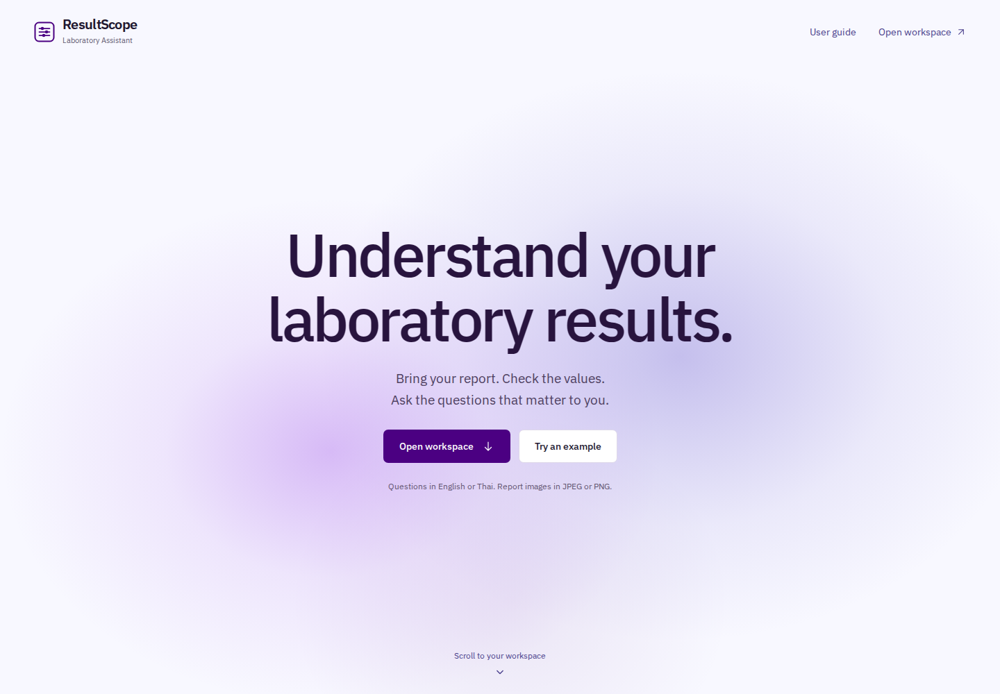
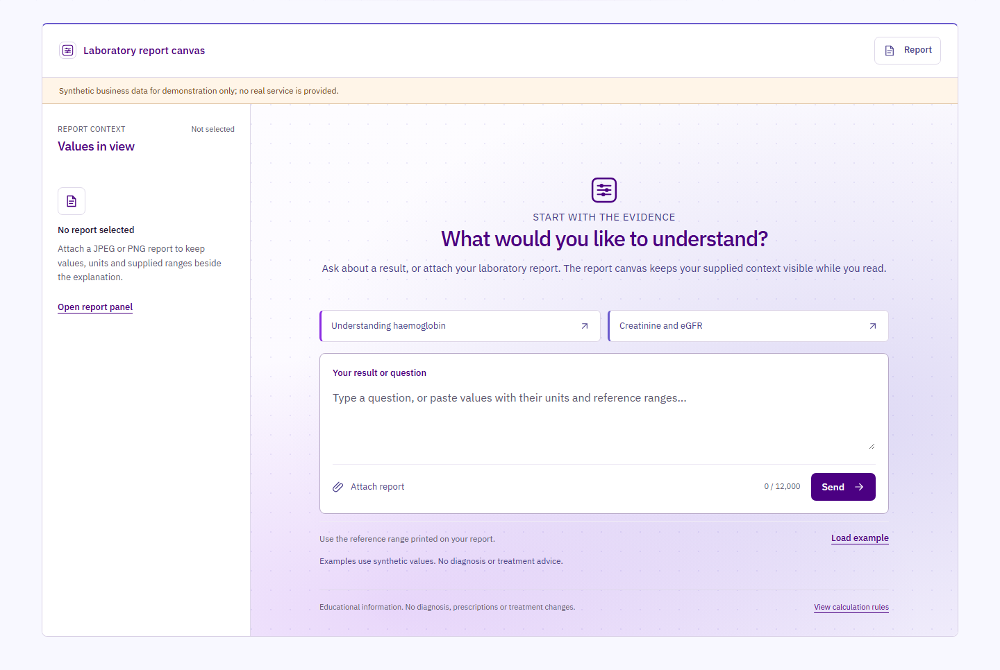
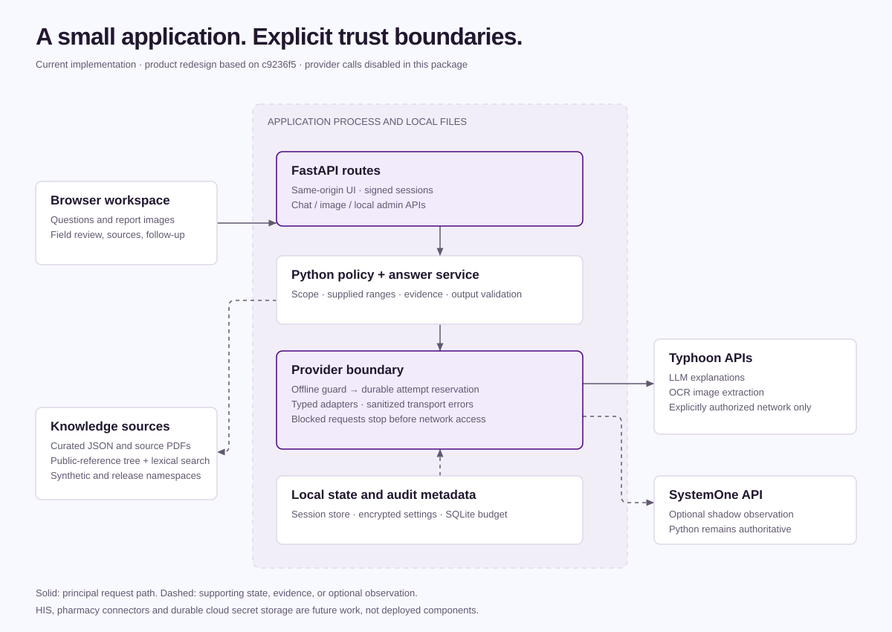

# ResultScope Laboratory Assistant

**Laboratory results, in context.**

ResultScope Laboratory Assistant is an educational laboratory workspace for reading supplied values, checking report images, and exploring explanations with their sources in view. It brings the report, reference range, explanation, and calculation details into one readable experience in English or Thai.

The current release is a **local product prototype**. It supports evaluation of the workflow and its safeguards; it has not established clinical effectiveness, production readiness, or commercial deployment readiness. Provider network access is disabled by default.





*The landing page leads directly into a conversation workspace. A report drawer keeps image review beside the chat; a full-screen panel serves the same task on mobile. See the [user guide](docs/user/USER_GUIDE.md) for the illustrated workflow and the evidence status of each screen.*

## The product proposition

A laboratory report contains measurements, units, and context that are easy to separate accidentally. ResultScope keeps those elements together. A reader can enter a result, verify what was extracted from an image, select a value, and inspect the supplied range before reading an explanation.

For laboratories, clinics, and future healthcare partners, the product hypothesis is a consistent explanation layer around existing results. Potential benefits include clearer preparation for a professional conversation and fewer repetitive requests for basic explanation. These are hypotheses to test with users and partner organizations; no time-saving, cost, patient-outcome, or adoption metrics have been established.

## What exists today

| Capability | Implemented behavior | Current limit |
|---|---|---|
| Laboratory questions | Python classifies intent and rejects unrelated or unsafe requests before generation | Educational scope; no diagnosis, prescribing, or treatment changes |
| Supplied-value review | Deterministic parsing and comparison with the range supplied by the user | Missing ranges remain unknown; public references do not become personal ranges |
| Report-image workflow | JPEG/PNG validation, OCR adapter, editable extraction, and explicit confirmation | OCR requires configured, authorized provider access; PDF upload is unsupported |
| Source-linked explanations | Local retrieval, source metadata, and validated explanation output | Generation depends on available evidence and provider access; no-hit cases abstain |
| Public-source comparison | Optional local metadata/alias tree for laboratory references and guideline notes | Separate from approved business data; source rights restrict release use |
| Local provider administration | Write-only key entry, encrypted local settings, separate mock tests | Local-demo mode only; no approved cloud secret persistence |
| Provider attempt control | Deny-by-default network guard and persistent SQLite attempt ledger | Coordinates processes sharing one ledger on one machine, not a distributed quota service |

The workspace uses the same visual language for intake, results, errors, report review, and administration. IBM Plex Sans and Noto Sans Thai are served locally. The owner-approved purple atmosphere is limited to the hero and chat. A native desktop scroll transition connects the two; mobile, reduced-motion and missing-animation-library paths keep the content static and usable.

## How it works



The browser calls a FastAPI application. Python owns scope decisions, supplied-range calculations, evidence selection, and output validation. Typhoon provides the default LLM and separate OCR integrations when explicitly enabled. OpenThai-SystemOne has a distinct iApp adapter and can observe decisions in shadow mode; it cannot override Python. Clef remains disabled.

See the [architecture](docs/engineering/ARCHITECTURE.md) for code paths, APIs, and storage behavior. HIS, pharmacy, and interoperability extensions in the roadmap are proposed work.

## Run a local review

From PowerShell in the repository root, preserve any existing environment and use the provider guard in the current process:

```powershell
if (!(Test-Path .venv)) { py -m venv .venv }
.\.venv\Scripts\Activate.ps1
python -m pip install -r requirements.txt
if (!(Test-Path .env)) { Copy-Item .env.example .env }
$env:PROVIDER_NETWORK_ENABLED = "false"
$env:STORAGE_BACKEND = "sqlite"
python -m uvicorn main:app --host 127.0.0.1 --port 8765
```

Open [http://127.0.0.1:8765](http://127.0.0.1:8765). This starts the real application without permitting LLM, OCR, or SystemOne transport. A request that needs a provider or approved evidence may show an unavailable or abstention state; an offline run does not simulate a successful generated answer.

Follow [local setup](docs/operations/LOCAL_SETUP.md) for environment preservation, non-Windows setup, and optional local administration. The application guide is also available at `/static/docs/user-guide.html` while the server runs.

## Verification and readiness

The repository includes deterministic, API, retrieval, image, provider-boundary, storage, and UI tests. The required Windows check is:

```powershell
$env:PROVIDER_NETWORK_ENABLED = "false"
powershell -ExecutionPolicy Bypass -File .\scripts\check.ps1
```

The retained UI preparation record reports **237 repository tests** and **50 addon tests** in its isolated Linux environment. The current repository hygiene closeout records a clean-checkout Windows `check.ps1` PASS on `1d90492` with **227 tests passed** and one existing warning, **16** exact-candidate UI captures, byte-preserving bundle checks, and an independent O1 review of the pre-integration candidate. Live provider re-validation and release gates remain blocked. See the [verification record](docs/evidence/REDESIGN_VERIFICATION.md) and [repository hygiene closeout](docs/evidence/REPO_HYGIENE_CLOSEOUT.md) for the separate evidence scopes.

Read [readiness and evidence](docs/operations/READINESS.md) before presenting the application beyond a controlled demonstration. It preserves the historical provider-budget overruns and identifies open release gates.

## Product direction

| Stage | Intended outcome | Gate before progression |
|---|---|---|
| Current local prototype | Review the laboratory explanation experience and safeguards | Reproducible offline checks and labelled demonstration evidence |
| Controlled evaluation | Establish source quality, user comprehension, and operating boundaries | Exact-candidate review, approved corpus and rights, authorized provider evidence |
| Partner pilot | Fit the workflow into a named laboratory or clinic process | Governance, identity/access, consent, retention, support, and deployment controls |
| Proposed HIS and pharmacy extensions | Connect reviewed laboratory context with partner workflows | Partner agreements, interoperability design, clinical oversight, and separately validated boundaries |

See the [product overview](docs/product/OVERVIEW.md), [roadmap](docs/product/ROADMAP.md), and [brand guide](docs/product/BRAND.md). There is no implemented HIS connector, pharmacy integration, medication recommendation feature, or FHIR interface in this release.

## Documentation and source

- [Documentation index](docs/README.md): role-based reading paths.
- [User guide](docs/user/USER_GUIDE.md): 14 illustrated steps for results, report review, sources and errors.
- [Printable PDF walkthrough](docs/user/ResultScope_User_Guide.pdf): 16 pages; [standalone HTML](static/docs/user-guide.html) opens locally.
- [Administrator guide](docs/operations/ADMIN_GUIDE.md): local-only settings and mock verification.
- [Development guide](docs/engineering/DEVELOPMENT.md): source map and verification workflow.
- [Data governance](docs/engineering/DATA_GOVERNANCE.md): data classes, storage, source rights, and release gaps.
- [Product contract](PRODUCT.md) and [design system](DESIGN.md): durable product and visual decisions.
- [Application entry point](main.py), [configuration defaults](config.py), and [test suite](tests/).

## Responsible use and attribution

Use synthetic or de-identified material for controlled demonstrations. ResultScope does not diagnose, recommend medication changes, or replace professional assessment. Signed session cookies and local secret protection do not establish a healthcare compliance certification or a complete patient-security architecture.

The repository derives from the KMITL Week 7 starter `chacharin/chatbot-it-kmitl`. Its [NOTICE](NOTICE.md) records unresolved upstream redistribution rights. Public-reference and guideline material also has separate rights and release restrictions. Resolve these before commercial distribution. ResultScope is a working product name; no trademark clearance is claimed.
