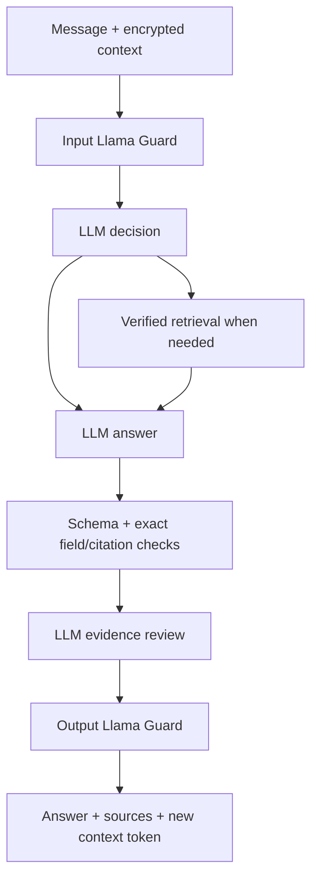

# LLM conversation architecture

FastAPI serves Jinja/vanilla JavaScript and `/api/v2`. The browser owns presentation
and an opaque encrypted context token. No patient memory database is required for v2.
The current UI never invokes the v1 keyword router or deterministic answer service.

The planner returns action, query, language and focus as JSON. It chooses answer,
clarify, redirect, urgent or social using the full recent conversation and optional
confirmed report. Missing retrieval support converts an answer task into clarification;
the LLM still supplies the wording. Query translation lets multilingual questions
reach the English/Thai corpus without a keyword gate on user intent.

The answer schema separates prose, source IDs, report observations and follow-up
suggestions. The server rejects unknown/mismatched citations and changed field values.
A further LLM review checks support, prose-level value fidelity and scope. Llama Guard
screens the final prose plus follow-ups. These checks reduce risk but do not establish
truth or clinical validity. No raw chain of thought is shown. SSE streams factual
processing status, then one validated answer; it does not leak pre-guard tokens.

## Report flow

A user selects a file or demo, previews it, consents, then requests reading. The server
validates image bytes or rasterizes up to three PDF pages. The vision/OCR provider sees
pixels. Typhoon transcription passes input guard before LLM JSON structuring. Structured
rows are returned as an encrypted draft. Structured rows and warnings also pass an output guard before display. The user corrects and confirms them. Confirmation
normalizes only simple printed range comparisons and starts fresh conversation history.
The model receives confirmed rows on later turns. The evaluator answer key is absent.

## State, cancellation and budget

AES-GCM tokens bind a purpose, signed-cookie session ID and expiry. Tab refresh clears
the frontend copy. Reset rotates the cookie; old tokens cannot join the new session.
The history window is at most 16 messages and 24,000 characters. This is bounded context,
not durable or longitudinal memory. Report pixels are not persisted by this pipeline.

Every upstream call reserves budget before transport. Local SQLite retains previous
cycle accounting. Cloud Redis uses one atomic Lua reservation with a persistent cap.
Errors, cancellation and timeouts do not refund uncertain attempts. Request cancellation
propagates to the active async operation. Cloud state uses no filesystem writes.
Vercel disables legacy `/api/v1`; retained legacy files support local migration tests only.

See [retrieval](RETRIEVAL.md), [guard ADR](../security/ADR-GUARD.md) and
[data governance](DATA_GOVERNANCE.md) for the independently testable boundaries.
