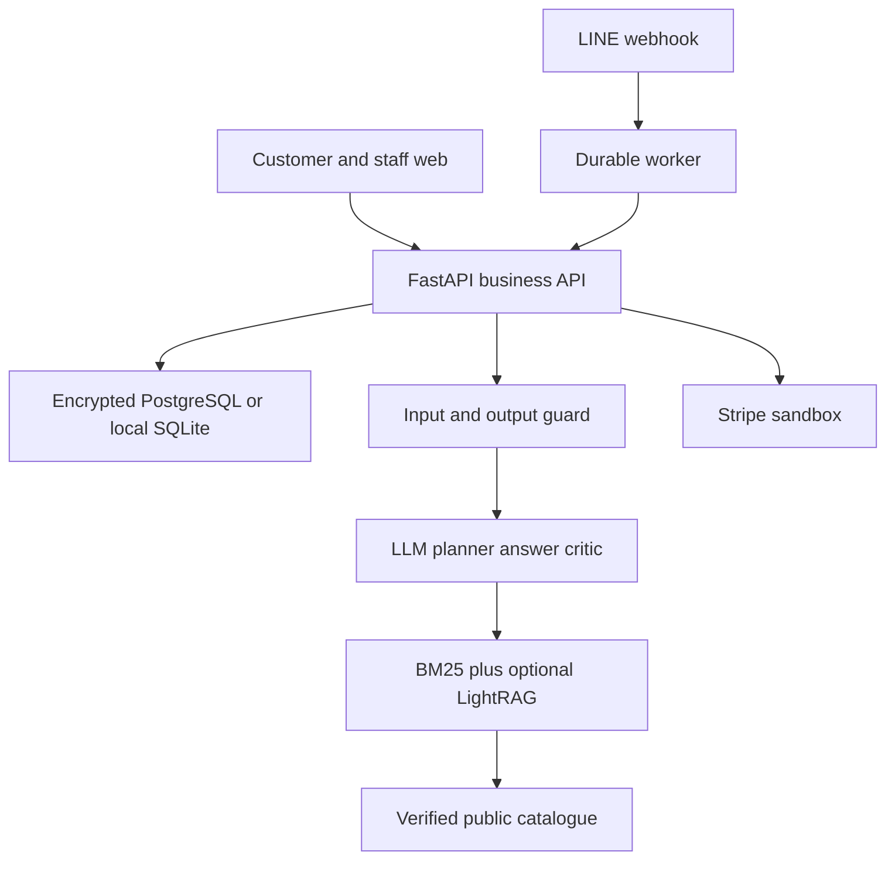
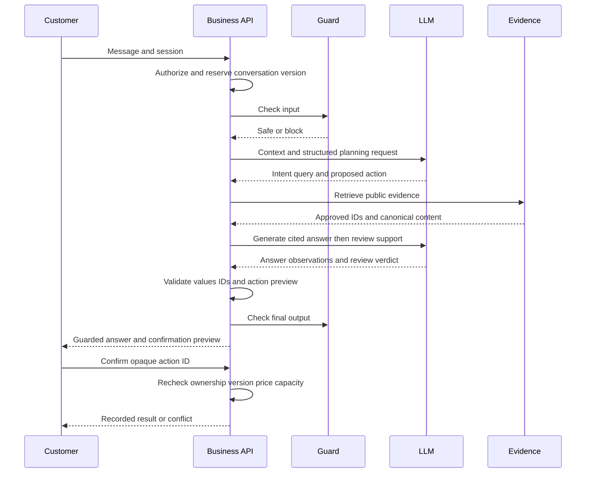

# As built architecture

Version 3.0.0, 2026-10-05. FastAPI, Jinja and vanilla JavaScript are retained. No React migration, fake local model or keyword intent tree is introduced. The model chooses a structured plan; backend services execute only authorized, validated actions.

## One message

A normal medical turn makes two guard calls and three conversation-model calls; LightRAG can add keyword/embedding work. No raw reasoning or unguarded token stream is exposed. Staff mode bypasses AI generation and saves messages to the staff conversation. In-flight drafts are discarded when the conversation version changes.

## Code ownership

| File | Responsibility |
|---|---|
| routers/business.py | Account, chat, booking, report, staff, quote and webhook routes |
| services/business_agent.py | LLM plan, evidence, answer, critic and output guard |
| services/business_store.py | Encrypted persistence, ownership, canonical catalog and pricing |
| services/business_integrations.py | LINE signature and delivery, Stripe sandbox signatures and checkout |
| services/business_worker.py | Durable leased LINE jobs and staff outbox |
| services/evidence_search.py | BM25, optional LightRAG /query/data, known-ID rank fusion |
| services/report_reader_v2.py | Image/PDF reading, OCR, structured fields and guard |
| services/iapp_ocr.py | Explicit iApp text/layout provider option |
| static/js/business.js | Customer and staff interaction, 4-second foreground customer/staff message polling |

## Data model

The rs_entities table stores id, kind, owner, state, branch, creation timestamps and encrypted payload. Entity kinds include user, email index, session, conversation, archive, report, booking, action, ticket, corporate_quote, line_identity, account_link, line_job, line_outbox, payment_event, configuration and audit. Metadata remains queryable; payloads use Fernet. Email lookup uses a digest, passwords use salted PBKDF2, and session tokens are random and stored by digest. This is application encryption, not database row-level security or a claim of regulatory compliance.

SQLite serializes mutations with BEGIN IMMEDIATE; PostgreSQL uses a mutex row lock. This favors correctness for coursework over high-throughput scalability. Capacity and idempotency are checked inside the same transaction. The original report is encrypted in the database, limited to 3 MB and 20 reports per customer; object storage is a future optimization. No destructive migration is run on startup.

## Transaction and channel boundaries

Booking requires an authenticated website account or verified LINE identity. Half-hour slots use Asia/Bangkok, Monday–Saturday, within 30 days; capacity comes from branch fixtures. Price edits invalidate unconfirmed previews. Confirmed orders retain agreed totals. Follow-up packages marked for review and organization requests go to staff.

Stripe accepts test-mode keys/events only. Success redirects and uploaded slips cannot settle orders. Signed webhook events must match booking, checkout ID, amount and THB currency. Refunds require a manager and are recorded only with the provider result; center refunds are explicit simulation receipts.

LINE webhook receipt persists a job and returns promptly. A worker processes text or images, validates signatures and deduplicates event IDs. Expired reply tokens require separately enabled push. Linking requires a short-lived one-use invitation, recent website login and consent; names do not establish identity. Unlink cancels pending deliveries and the worker rechecks identity before sending. A network send already in flight cannot be recalled. Failed/uncertain generations are not automatically replayed.

## Retrieval and clinical boundaries

Business fixtures are separate from real medical evidence. Only knowledge/evidence/catalog.json is runtime RAG. The approved source IDs are exported for LightRAG; arbitrary remote chunks cannot become citations. Patient reports remain private context. The 68-source discovery manifest records downloads and failures; raw guidelines, old manuals and unresolved research citations are not automatically trusted. Numeric source intervals are contextual examples, not patient diagnoses or generic emergency thresholds.

## Deployment boundary

Vercel hosts the stateless API/static assets with PostgreSQL and Redis. LINE needs a persistent external worker or an authenticated caller of /api/business/worker/run; do not start a background loop inside a Vercel request. Render can run API plus worker with scripts/run_business.py and external durable storage. LightRAG is a separate service. PGTableGraphStorage in the reviewed upstream can store the graph without Apache AGE; vector storage still needs pgvector. Pin a tested upstream revision and embedding identity before ingestion.

The machine-readable endpoint contract is api-contract.json generated from this application. PostgreSQL, provider, external map, LINE and payment connections are implemented but live NOT_RUN.
