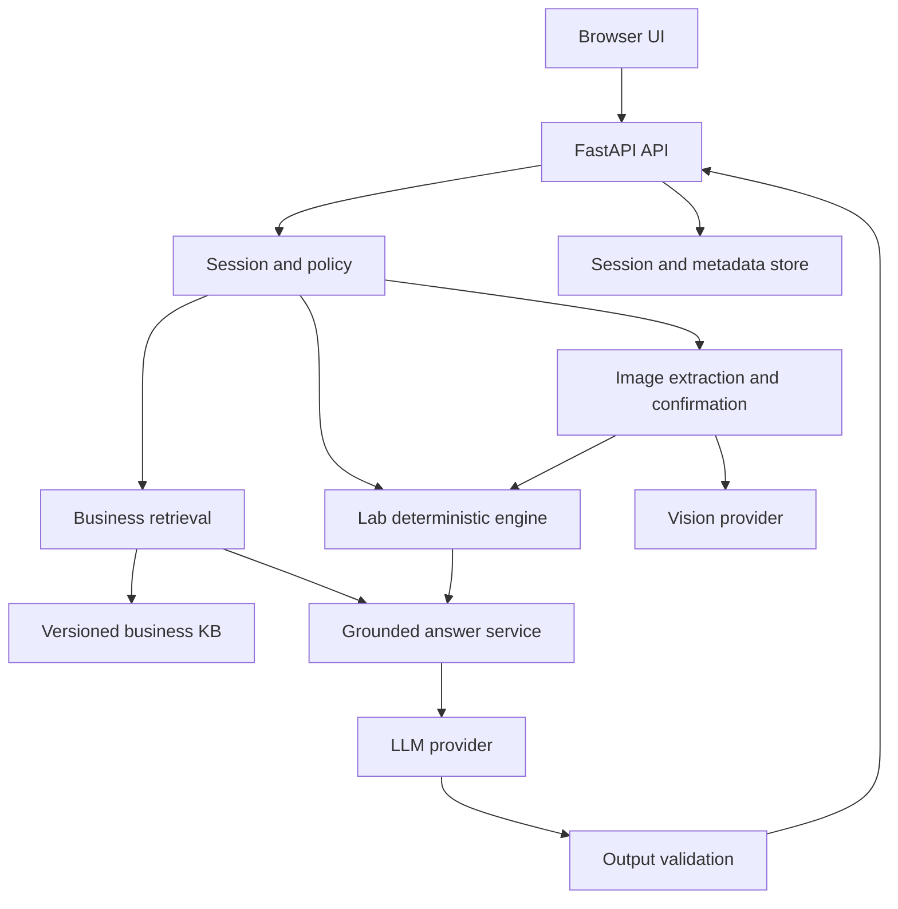
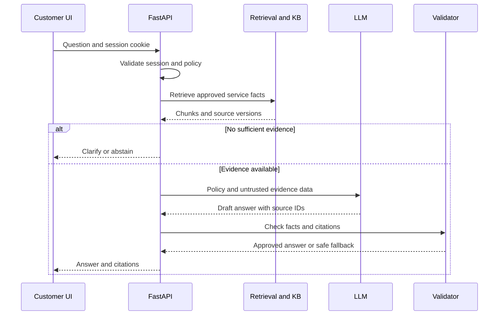

# สถาปัตยกรรมเป้าหมายและ API contracts

สถานะ: proposed target สำหรับ MAIN ให้ P0 ตรวจ baseline และ P6 เปลี่ยนเป็น as-built ก่อนส่งการบ้าน ไม่อ้าง diagram นี้เป็นระบบที่สร้างเสร็จแล้ว

## หลักการ

FastAPI หนึ่งแอป same-origin UI เริ่มจาก business เดียว บริการภายในเป็น Python functions ไม่สร้าง HTTP endpoint ทุก module มี route จริงเท่าที่ UI/ผู้ตรวจต้องใช้ คง transport abstraction และ compatibility ของ endpoints เดิม โดย version contract เมื่อเปลี่ยนความหมาย



## Routing และ evidence authority

1. Validate request/session/rate ก่อน external call
2. แยก business FAQ, lab education, mixed, unrelated, unsafe อย่าง deterministic ก่อน อนุญาตราคา/วันเปิด/การเตรียมตัวที่ผูกกับแล็บ ไม่เปิด general assistant
3. แหล่ง truth ของบริการ/ราคา/นโยบายคือ approved business KB; user image ไม่แก้ราคา/นโยบายร้าน
4. ค่าผลตรวจมาจาก user-supplied text หรือ confirmed extraction เท่านั้น; reference range ของรายงานไม่ปะปนกับคำอธิบายทั่วไปใน KB
5. ข้อมูล retrieved/OCR เป็น untrusted data ไม่ใช่คำสั่ง system แม้มีข้อความ “ignore previous instructions”
6. Generation ต้องใช้ source IDs ที่ server ส่งให้; missing/conflicting/expired source ให้ clarify/abstain ไม่ตอบจาก model memory
7. คำอธิบายสุขภาพใน coursework ใช้ข้อความการศึกษาที่ owner ตรวจและอนุมัติใน KB ไม่ใช้ free-form clinical reasoning เพื่อเติมข้อมูลที่ไม่มี

## Data contracts ที่เสนอ

| Record | Fields หลัก | Validation |
|---|---|---|
| BusinessSource | source_id, business_id, title, version, effective_at, reviewed_at, status, checksum, origin, permission | status=approved ก่อน retrieval; version immutable |
| Service | service_id, name_th, aliases, price, currency, preparation_source_id, source_id | price nullable; ไม่เติมราคา/ข้อเตรียมตัวเอง |
| Chunk | chunk_id, source_id, text, section, embedding_model, dimensions, corpus_version | source exists; embedding model/dimension ตรงกัน |
| EvidenceRef | source_id, chunk_id, version, title, excerpt | server resolve จริง; model สร้าง URL arbitrary ไม่ได้ |
| Extraction | extraction_id, session_owner, document_type, fields, warnings, status, expires_at | status extracted/review_required/confirmed; isolated owner |
| LabField | marker, raw_value, numeric_value, unit, supplied_range, provenance | nullable; ห้ามเปลี่ยนหน่วยหรือเดาทศนิยม |
| Answer | answer_id, request_id, kind, text, citations, kb_version, policy_version, warnings | kind answered/clarify/abstained/refused/error |

ไม่ใช้ confidence ที่โมเดลกล่าวเองเป็น probability ความถูกต้อง คำว่า reviewed/confirmed หมายถึงขั้นตอนจริง ไม่ใช่ confidence สูง

## Routes

| Route | สถานะ | Purpose และ boundary |
|---|---|---|
| GET /health | เดิม | liveness ไม่เปิดเผย keys |
| GET /api/v1/product | เดิม ปรับ metadata | ชื่อ/ขอบเขตธุรกิจ; ห้ามเผย secret config |
| GET /api/v1/rules | เดิม | public policy summary ที่ไม่บรรจุ secret |
| POST /api/v1/scope/check | เดิม ปรับ classifier | ตรวจ business/lab scope เหมือน chat |
| GET /api/v1/models | เดิม | owner-only หรือปิด public ถ้าไม่ใช้; diagram final ต้องตรง |
| POST /api/v1/chat | เดิม ขยาย | validated grounded answer |
| POST /api/v1/chat/stream | เดิม ปรับ | status events ระหว่างทำงาน; ส่ง answer หลังตรวจแล้ว |
| POST /api/v1/chat/reset | เดิม harden | clear state + rotate session; ลบผิดพลาดไม่ส่ง ok |
| POST /api/v1/images/extract | ใหม่ | multipart image หนึ่งภาพ ใช้ session-bound extraction ID |
| POST /api/v1/images/{id}/confirm | ใหม่ | corrected fields + revision; ตรวจ owner และ schema |
| GET /api/v1/sources/{source_id} | ใหม่ | approved public excerpt/version เท่านั้น ไม่มี raw file path |
| POST /api/v1/feedback | Plus | optional answer_id + vote; ตรวจ owner/rate ไม่มีชื่อคน |
| GET /api/v1/session/export | Plus | export เฉพาะ session ปัจจุบัน |

P2 ต้องคง minimal `reply`/`scope` สำหรับ client เดิม หรือ migrate UI/tests พร้อมกันและระบุ contract version ห้ามเพิ่ม field แล้วปล่อย tests เก่าลวงว่า coverage ใหม่ครบ

ตัวอย่าง request ใหม่ (schema เป้าหมาย ไม่ใช่ endpoint ที่มีแล้ว):

```json
{"message":"แพ็กเกจนี้ราคาเท่าไร","extraction_id":null,"client_request_id":"unique-id"}
```

Server เป็นผู้กำหนด session, business และ tenant ห้ามเชื่อ business_id/session_owner จาก client ใน future multitenant deployment

## SSE contract

event status: validating/retrieving/generating/checking; event answer: complete validated Answer; event error: safe code/message/request_id; event done: terminal ครั้งเดียว ไม่มี raw answer delta ก่อนตรวจ output ถ้าต้องการ animation ให้ UI เผยข้อความที่ผ่านตรวจแล้วทีละส่วน ไม่อ้างว่าเป็น raw streaming

## Errors, limits และ storage

400 malformed, 401/403 unauthorized, 413 oversized image, 415 unsupported image, 422 invalid schema, 429 rate limit, 502 provider failure, 503 missing configuration/unavailable store ตามเส้นทางจริง SSE ที่เริ่ม 200 ไปแล้วใช้ error event และห้ามบันทึกเป็น successful answer

ค่าเริ่มต้นเสนอ: JPEG/PNG ≤3 MB, decoded pixels ≤12 MP, image ทีละหนึ่ง, message ≤12,000 chars ตามเดิม, timeouts แยก provider และ request budget, retry transient ครั้งเดียวเมื่อไม่เพิ่ม side effect duplicate ค่าจริงต้องต่ำกว่าข้อจำกัด deployment ที่ตรวจใน P6 ไม่ส่ง raw exception หรือ provider body ถึงลูกค้า

Local SQLite รองรับ session/extraction metadata; serverless ต้อง store ภายนอกสำหรับ state ที่ต้องอยู่ข้าม instance Raw image ไม่เก็บถาวรโดย default ลบทันทีหลัง extract และใช้ browser preview; metadata มี TTL (เสนอ 24 ชั่วโมง) Reset ลบ derived fields ด้วย Explicit storage unavailable ต้อง fail/degraded notice ที่ตรวจได้ ไม่ silent success

Session token ต้อง signed หรือ opaque server-issued token พร้อม validation, HttpOnly, Secure เมื่อ HTTPS, SameSite และ origin checks สำหรับ state changes ป้องกัน guessing/tampering ไม่ถือว่าการเปลี่ยน UUID อย่างเดียวพิสูจน์ isolation

## Target data flow ของหนึ่งคำถามราคา



P6 เก็บ request_id จริงหนึ่งรายการและปรับ diagram ให้ตรง implementation รวม store write/error branch ถ้าใช้งานจริง Diagram ไม่ต้องวาดทุก optional module
