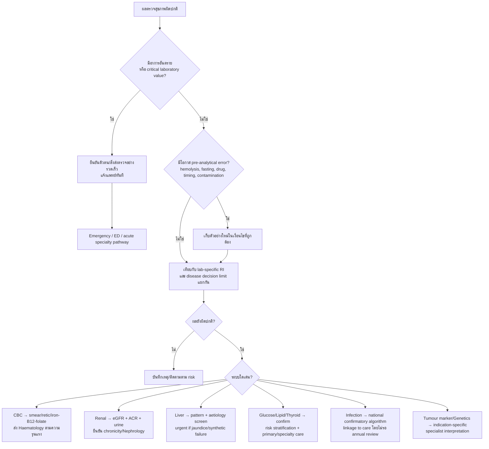
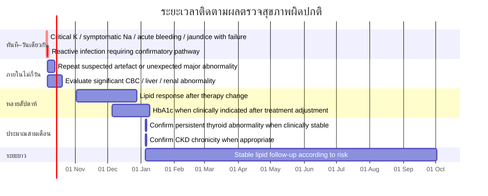

# ช่วงอ้างอิงและรายการตรวจทางห้องปฏิบัติการสำหรับการตรวจสุขภาพในประเทศไทย เทียบมาตรฐานสากล

## บทสรุปผู้บริหาร

รายงานนี้รวบรวมช่วงอ้างอิง (reference intervals), decision limits, รายการตรวจ และแนวทางติดตามผลที่ใช้ได้จริงกับงานตรวจสุขภาพในประเทศไทย โดยให้น้ำหนักสูงสุดกับแหล่งข้อมูลภาษาไทยจาก **กรมการแพทย์ กระทรวงสาธารณสุข, กรมควบคุมโรค, สมาคมวิชาชีพไทย และคู่มือห้องปฏิบัติการศิริราช** แล้วจึงเติมช่องว่างด้วย WHO, KDIGO, CDC, NICE, CLSI, NHS/Leeds, ARUP, Mayo Clinic Laboratories และ University of Iowa. แนวทางตรวจสุขภาพของกรมการแพทย์ฉบับปรับปรุง พ.ศ. 2565 แบ่งประชากรเป็นเด็ก/วัยรุ่น 0–18 ปี, วัยทำงาน 19–60 ปี และผู้สูงอายุ ≥60 ปี และเน้นการตรวจที่ “จำเป็นและเหมาะสม” ตามอายุและความเสี่ยง มากกว่าการสั่งชุดตรวจขนาดใหญ่ให้ทุกคนเหมือนกัน. citeturn25search0turn25search2

**ข้อสำคัญที่สุดในการใช้ตารางนี้คือ “ค่าปกติ” ไม่ใช่ค่าตายตัวสากล**. Reference interval มักหมายถึงช่วงที่ครอบคลุมประมาณ 95% ของประชากรอ้างอิงที่กำหนด แต่ค่าจริงขึ้นกับประชากร อายุ เพศ การตั้งครรภ์ เวลาเก็บตัวอย่าง การอดอาหาร เครื่องมือ reagent calibration และวิธีวิเคราะห์; สำหรับหลายการตรวจ เช่น HbA1c, glucose, LDL-C, vitamin D, troponin, PSA และ tumour markers ควรแยก “reference interval” ออกจาก **clinical decision limit** ที่ใช้วินิจฉัยหรือรักษา. citeturn11search2turn11search6

สำหรับประเทศไทย คู่มือออนไลน์ของศิริราชเป็นแหล่งที่มีประโยชน์มากเป็นพิเศษ เพราะระบุ **วิธีวิเคราะห์, สิ่งส่งตรวจ, การเตรียมผู้ป่วย และช่วงอ้างอิงที่ใช้อยู่จริงในห้องปฏิบัติการไทย** ครอบคลุม CBC, chemistry, hormones, vitamins, tumour markers, immunology, microbiology และ genetics. citeturn30search6turn2view1 อย่างไรก็ตาม ค่าเหล่านี้เป็น **local laboratory reference intervals ไม่ใช่ national Thai reference intervals** ดังนั้นเมื่อแปลผลผู้ป่วยจริงต้องใช้ช่วงที่พิมพ์บนรายงานของห้องปฏิบัติการนั้นเป็นหลัก.

ในด้านคุณภาพห้องปฏิบัติการ หน่วยงานรับรองของกรมวิทยาศาสตร์การแพทย์ยังเผยแพร่ข้อกำหนดที่เชื่อมโยงกับ ISO 15189 และข้อกำหนดทางเทคนิคสำหรับห้องปฏิบัติการทางการแพทย์ ซึ่งเป็นกรอบที่เหมาะสมสำหรับการกำหนด/ทวนสอบ reference intervals และการรายงานผลในประเทศไทย. citeturn2view2turn0search6

มีความแตกต่างที่มีนัยสำคัญระหว่างแหล่งข้อมูล เช่น sodium ศิริราช 136–145 mmol/L เทียบ Leeds NHS 133–146 mmol/L, potassium 3.4–4.5 เทียบ 3.5–5.3 mmol/L, ferritin ชายศิริราช 30–400 ng/mL เทียบ Leeds 30–337 µg/L และ vitamin D ศิริราชใช้ decision limit ≥30 ng/mL หรือ ≥75 nmol/L ขณะที่ Leeds ปี 2026 ถือ 50–99 nmol/L ว่า sufficient. ความแตกต่างเช่นนี้เป็นเหตุผลที่ไม่ควรนำค่า cut-off จากอินเทอร์เน็ตไปแทนช่วงอ้างอิงของห้องปฏิบัติการที่ออกผล. citeturn5view0turn18view3turn19view0turn20view1turn12view0

สุดท้าย “มีบริการตรวจในแพ็กเกจตรวจสุขภาพ” ไม่เท่ากับ “ควรตรวจประชากรทุกคน”. ตัวอย่างจากโรงพยาบาลจุฬาลงกรณ์แสดงว่าการตรวจสุขภาพในไทยอาจเสนอ HbA1c, thyroid tests, Anti-HAV, HBsAg/Anti-HBs/Anti-HBc, Anti-HCV, HIV, VDRL, AFP, CEA, PSA และ stool examination แต่ข้อบ่งชี้ควรพิจารณาอายุ ประวัติ ปัจจัยเสี่ยง และแนวทางเฉพาะโรค. citeturn14search7turn25search0

## หลักการใช้ช่วงอ้างอิงและขอบเขตการตรวจสุขภาพ

คำว่า **RI** ในตารางด้านล่างหมายถึง reference interval ของคนที่ห้องปฏิบัติการใช้เป็นกลุ่มอ้างอิง ส่วน **DL** หมายถึง decision limit หรือเกณฑ์ตัดสินใจทางคลินิก. การสับสนสองแนวคิดนี้ทำให้เกิดความผิดพลาดบ่อย เช่น LDL-C ของศิริราชมี laboratory reference `<130 mg/dL` แต่ผู้ป่วยโรคหัวใจและหลอดเลือดอาจต้องมีเป้าหมายต่ำกว่านั้นมากตามระดับ cardiovascular risk; แนวทางไทย พ.ศ. 2567 จึงใช้การประเมินความเสี่ยงและเป้าหมายการรักษา ไม่ได้ใช้ “<130 = ปกติ” เป็นคำตอบสุดท้าย. citeturn5view3turn27search3

ในทำนองเดียวกัน HbA1c ของศิริราชมีช่วงอ้างอิง 4.8–5.9% แต่เกณฑ์วินิจฉัยเบาหวานเป็น clinical decision threshold ที่สูงกว่า; plasma fasting glucose ของศิริราชในผู้ใหญ่ >15 ปีอยู่ที่ 74–99 mg/dL ขณะที่ Leeds แยก fasting glucose 3.5–6.0 mmol/L, impaired fasting glucose 6.1–6.9 และ diabetes ≥7.0 mmol/L. citeturn6view0turn5view1turn18view2 แนวทางเบาหวานไทย พ.ศ. 2566 จัดทำร่วมโดยราชวิทยาลัยอายุรแพทย์ฯ สมาคมโรคเบาหวานฯ สมาคมต่อมไร้ท่อฯ กรมการแพทย์ และ สปสช. และควรเป็นแหล่งหลักสำหรับ diagnostic criteria และเป้าหมาย HbA1c ในบริบทไทย. citeturn27search0turn27search4

ค่าเด็กต้องใช้ **age-specific intervals** อย่างจริงจัง. ตัวอย่าง ALP ของศิริราชเปลี่ยนจาก 122–469 U/L ในทารก 15 วัน–<1 ปี ไปถึง 116–468 U/L ในเด็กชาย 13–<15 ปี แต่ผู้ใหญ่ชายเหลือ 40–129 U/L; การใช้ช่วงผู้ใหญ่กับเด็กจึงอาจทำให้ผลที่ปกติในช่วงโตเร็วถูกตีความเป็นโรคตับหรือกระดูก. citeturn4view1 TSH, FT4, phosphate, calcium, creatinine และ CBC ก็มีช่วงตามอายุเช่นเดียวกัน. citeturn5view5turn19view2turn19view4turn30search0turn4view5turn8view0

เพศและภาวะสืบพันธุ์ก็สำคัญ: Hb, Hct, RBC, ferritin, HDL-C, uric acid, testosterone, estradiol, FSH/LH และบาง tumour markers ต้องพิจารณา sex-specific หรือ menstrual/menopausal phase. citeturn8view0turn19view0turn5view2turn5view6turn19view6turn1search6turn17view1

สำหรับผล qualitative เช่น infectious serology, cultures และ genetic tests ไม่มี “ช่วงตัวเลขปกติ” แบบ chemistry. รายงานควรเป็น non-reactive/reactive, not detected/detected, no growth/growth หรือ genotype/variant classification ตามวิธีตรวจ. การทดสอบความไวต่อยาต้านจุลชีพควรอิง breakpoints ของมาตรฐานปัจจุบัน เช่น **CLSI M100, 36th Edition, 2026** ซึ่งเผยแพร่ 26 มกราคม 2026 และมี correction ในเดือนกรกฎาคม 2026. citeturn28search0turn28search8

## ตารางอ้างอิงรายการตรวจที่ใช้ในประเทศไทย

ช่วงต่อไปนี้เป็น **ค่าทั่วไปสำหรับผู้ใหญ่เมื่อไม่ได้ระบุเป็นอย่างอื่น**. เมื่อมีค่าไทยจะเลือกไทยก่อน; เครื่องหมาย “ตาม assay/lab” หมายถึงไม่ควรสร้าง universal cutoff เอง. ตารางนี้เหมาะสำหรับการออกแบบ health-check system, LIS/report template หรือการตรวจสอบความสมเหตุสมผลของผล ไม่ควรใช้แทน reference interval ที่ห้องปฏิบัติการออกให้กับตัวอย่างจริง.

| หมวด / การทดสอบ | ช่วงอ้างอิงหรือเกณฑ์ทั่วไป | หน่วย | ข้อสังเกต | แหล่งและดาวน์โหลด |
|---|---:|---|---|---|
| **CBC — WBC** | หญิง 4.4–10.3; ชาย 4.5–11.3 | ×10³/µL | sex-specific; เด็กต่างตามอายุ | [Siriraj Haematology PDF](https://www.si.mahidol.ac.th/th/manual/Project/PDF/Reference-Ranges-Hematology-2016.pdf) citeturn8view0 |
| RBC | หญิง 4.0–5.5; ชาย 4.2–6.1 | ×10⁶/µL | ใช้ร่วม Hb/Hct/indices | [Siriraj PDF](https://www.si.mahidol.ac.th/th/manual/Project/PDF/Reference-Ranges-Hematology-2016.pdf) citeturn8view0 |
| Haemoglobin | หญิง 12.0–14.9; ชาย 12.7–16.9 | g/dL | WHO ใช้ diagnostic anaemia cut-offs แยกต่างหาก | [Siriraj PDF](https://www.si.mahidol.ac.th/th/manual/Project/PDF/Reference-Ranges-Hematology-2016.pdf); [WHO 2024 PDF](https://iris.who.int/bitstreams/f9f74397-1440-478d-a63c-26f29a01552f/download) citeturn8view0turn26search3 |
| Haematocrit | หญิง 37.0–45.7; ชาย 40.3–51.9 | % | sex-specific | [Siriraj PDF](https://www.si.mahidol.ac.th/th/manual/Project/PDF/Reference-Ranges-Hematology-2016.pdf) citeturn8view0 |
| MCV | หญิง 80.4–95.9; ชาย 80.6–98.8 | fL | micro/macrocytosis ต้องดู Hb, retic, iron/B12/folate | [Siriraj PDF](https://www.si.mahidol.ac.th/th/manual/Project/PDF/Reference-Ranges-Hematology-2016.pdf) citeturn8view0 |
| MCH | หญิง 25.0–31.2; ชาย 25.8–33.1 | pg | sex-specific ที่ศิริราช | [Siriraj PDF](https://www.si.mahidol.ac.th/th/manual/Project/PDF/Reference-Ranges-Hematology-2016.pdf) citeturn8view0 |
| MCHC | หญิง 30.2–34.2; ชาย 30.8–34.6 | g/dL |  | [Siriraj PDF](https://www.si.mahidol.ac.th/th/manual/Project/PDF/Reference-Ranges-Hematology-2016.pdf) citeturn8view0 |
| RDW | หญิง 11.7–15.0; ชาย 11.9–14.5 | % | Leeds 12–15% | [Siriraj PDF](https://www.si.mahidol.ac.th/th/manual/Project/PDF/Reference-Ranges-Hematology-2016.pdf) citeturn8view0turn18view0 |
| Platelet | หญิง 179–435; ชาย 160–356 | ×10³/µL | Leeds ใช้ 150–400 ×10⁹/L | [Siriraj PDF](https://www.si.mahidol.ac.th/th/manual/Project/PDF/Reference-Ranges-Hematology-2016.pdf) citeturn8view0turn18view3 |
| Neutrophil | หญิง 40–73.1%; ชาย 40–70.3%; absolute หญิง 1.8–6.8, ชาย 2.1–7.2 | %, ×10³/µL | absolute count สำคัญกว่าร้อยละสำหรับ neutropenia | [Siriraj PDF](https://www.si.mahidol.ac.th/th/manual/Project/PDF/Reference-Ranges-Hematology-2016.pdf) citeturn8view0 |
| Lymphocyte | หญิง 20.3–47.9%; ชาย 18.7–48.3%; absolute 1.2–3.4 / 1.3–3.5 | %, ×10³/µL | เด็กมี lymphocyte สูงกว่าผู้ใหญ่ได้ตามวัย | [Siriraj PDF](https://www.si.mahidol.ac.th/th/manual/Project/PDF/Reference-Ranges-Hematology-2016.pdf) citeturn8view0 |
| Monocyte | 3.4–9.7% หญิง; 3.9–12.3% ชาย | % | absolute หญิง 0.2–0.6; ชาย 0.2–0.9 ×10³/µL | [Siriraj PDF](https://www.si.mahidol.ac.th/th/manual/Project/PDF/Reference-Ranges-Hematology-2016.pdf) citeturn8view0 |
| Eosinophil | 0.4–7.5% หญิง; 0.8–9.2% ชาย | % | allergy/parasite/drug context | [Siriraj PDF](https://www.si.mahidol.ac.th/th/manual/Project/PDF/Reference-Ranges-Hematology-2016.pdf) citeturn8view0 |
| Basophil | 0.2–1.4% หญิง; 0.1–1.4% ชาย | % |  | [Siriraj PDF](https://www.si.mahidol.ac.th/th/manual/Project/PDF/Reference-Ranges-Hematology-2016.pdf) citeturn8view0 |
| Reticulocyte | Leeds 0.64–2.52%; absolute 29–106 | %, ×10⁹/L | ใช้แปลกลไก anaemia | [Leeds 2026 PDF](https://www.leedsth.nhs.uk/wp-content/uploads/2026/08/BSHC-REC-317b_Blood-Sciences-Reference-Range-Database_v3.20.pdf) citeturn17view4 |
| **Electrolytes — Sodium** | 136–145 | mmol/L | Leeds 133–146 | [Siriraj Electrolytes PDF](https://www.si.mahidol.ac.th/th/manual/Project/pdf/electrolytes.pdf) citeturn5view0turn17view4 |
| Potassium | 3.4–4.5 | mmol/L | Leeds ผู้ใหญ่ 3.5–5.3; hemolysis อาจทำให้สูงปลอม | [Siriraj Electrolytes PDF](https://www.si.mahidol.ac.th/th/manual/Project/pdf/electrolytes.pdf) citeturn5view0turn18view3 |
| Chloride | 98–107 | mmol/L | Leeds ใช้ช่วงกว้างต่างตามระบบ | [Siriraj Electrolytes PDF](https://www.si.mahidol.ac.th/th/manual/Project/pdf/electrolytes.pdf) citeturn5view0 |
| Total CO₂ / bicarbonate | 22–29 | mmol/L | acid-base interpretation ต้องดู clinical context/gas | [Siriraj Electrolytes PDF](https://www.si.mahidol.ac.th/th/manual/Project/pdf/electrolytes.pdf) citeturn5view0 |
| Total calcium | 18–60 ปี 8.6–10.0 | mg/dL | 60–90 ปี 8.8–10.2; ควรแปลร่วม albumin | [Siriraj Calcium PDF](https://www.si.mahidol.ac.th/th/manual/Project/PDF/Calcium.pdf) citeturn30search0 |
| Ionised calcium | 4.6–5.2 | mg/dL | pH-dependent; useful when albumin/protein abnormal | [Siriraj Ionised Ca PDF](https://www.si.mahidol.ac.th/th/manual/Project/pdf/ca-ionized.pdf) citeturn30search4 |
| Magnesium | 21–59 ปี 1.6–2.6 | mg/dL | 60–90 ปี 1.6–2.4 | [Siriraj Mg PDF](https://www.si.mahidol.ac.th/th/manual/Project/pdf/magnesium.pdf) citeturn19view3 |
| Phosphate | ผู้ใหญ่ 2.5–4.5 | mg/dL | pediatric RI สูงและ sex-specific บางวัย | [Siriraj Phosphate PDF](https://www.si.mahidol.ac.th/th/manual/Project/pdf/phosphate.pdf) citeturn19view4 |
| Osmolality | ใช้ laboratory-specific interval | mOsm/kg | Leeds มี harmonised laboratory RI; ควรใช้คู่ Na/glucose/urea | [Leeds 2026 PDF](https://www.leedsth.nhs.uk/wp-content/uploads/2026/08/BSHC-REC-317b_Blood-Sciences-Reference-Range-Database_v3.20.pdf) citeturn16view1 |
| **Renal — BUN** | 18–60 ปี 6–20; 60–90 ปี 8–23 | mg/dL | เด็ก <1 ปี 4–19; 1–18 ปี 5–18 | [Siriraj BUN PDF](https://www.si.mahidol.ac.th/th/manual/Project/pdf/bun.pdf) citeturn4view4 |
| Creatinine | ชาย 0.67–1.17; หญิง 0.51–0.95 | mg/dL | sex-/muscle-mass-dependent; pediatric ranges ต่างมาก | [Siriraj Creatinine PDF](https://www.si.mahidol.ac.th/th/manual/Project/pdf/creatinine.pdf) citeturn4view5 |
| eGFR | G1 ≥90; G2 60–89; G3a 45–59; G3b 30–44; G4 15–29; G5 <15 | mL/min/1.73m² | **GFR category ไม่ใช่ RI**; CKD ต้องพิจารณาความเรื้อรัง/markers | [KDIGO 2024 PDF](https://kdigo.org/wp-content/uploads/2024/03/KDIGO-2024-CKD-Guideline.pdf); [Thai CKD PDF](https://www.nephrothai.org/wp-content/uploads/2023/03/CKD-guideline-2565-revised-edition.pdf) citeturn26search6turn27search2 |
| Urine ACR | A1 <30 mg/g (<3 mg/mmol); A2 30–300; A3 >300 | mg/g | decision categories; repeat incidental abnormality | [Thai CKD PDF](https://www.nephrothai.org/wp-content/uploads/2023/03/CKD-guideline-2565-revised-edition.pdf); [KDIGO](https://kdigo.org/wp-content/uploads/2024/03/KDIGO-2024-CKD-Guideline.pdf) citeturn27search2turn26search6 |
| Uric acid | ชาย 3.4–7.0; หญิง 2.4–5.7 | mg/dL | gout treatment target ≠ RI | [Siriraj UA PDF](https://www.si.mahidol.ac.th/th/manual/Project/pdf/ua.pdf) citeturn5view6 |
| Cystatin C | assay-specific | mg/L | ใช้ช่วยประเมิน GFR เมื่อ creatinine มีข้อจำกัด | [KDIGO 2024](https://kdigo.org/wp-content/uploads/2024/03/KDIGO-2024-CKD-Guideline.pdf) citeturn26search2turn26search6 |
| **Liver — Albumin** | ผู้ใหญ่ 3.5–5.2 | g/dL | 0–4 วัน 2.8–4.4; เด็กต่างตามวัย | [Siriraj Albumin PDF](https://www.si.mahidol.ac.th/th/manual/Project/pdf/albumin.pdf) citeturn4view0 |
| Total protein | 6.4–8.3 | g/dL | posture/hydration affect concentration | [Siriraj PDF](https://www.si.mahidol.ac.th/th/manual/Project/pdf/total-protein.pdf) citeturn20view0 |
| AST | ชาย 5–40; หญิง 5–32 | U/L | muscle injury can contribute | [Siriraj AST PDF](https://www.si.mahidol.ac.th/th/manual/Project/pdf/ast.pdf) citeturn4view3 |
| ALT | Leeds adult ≤40 | U/L | method/lab specific; clinical concern depends pattern and context | [Leeds 2026 PDF](https://www.leedsth.nhs.uk/wp-content/uploads/2026/08/BSHC-REC-317b_Blood-Sciences-Reference-Range-Database_v3.20.pdf) citeturn12view0 |
| ALP | ชาย ≥19 ปี 40–129; หญิง 35–104 | U/L | very age-dependent in children/adolescents | [Siriraj ALP PDF](https://www.si.mahidol.ac.th/th/manual/Project/pdf/alp.pdf) citeturn4view1 |
| GGT | Leeds หญิง 6–40; ชาย 12–68 | U/L | alcohol/drugs/cholestasis context | [Leeds 2026 PDF](https://www.leedsth.nhs.uk/wp-content/uploads/2026/08/BSHC-REC-317b_Blood-Sciences-Reference-Range-Database_v3.20.pdf) citeturn18view2 |
| Total bilirubin | 0–1.2 | mg/dL | fractionate when indicated | [Siriraj Bilirubin PDF](https://www.si.mahidol.ac.th/th/manual/Project/pdf/Bilirubin.pdf) citeturn4view6 |
| Direct bilirubin | ตาม assay/lab | mg/dL หรือ µmol/L | interpret with total bilirubin and pattern | [Leeds 2026 PDF](https://www.leedsth.nhs.uk/wp-content/uploads/2026/08/BSHC-REC-317b_Blood-Sciences-Reference-Range-Database_v3.20.pdf) citeturn12view0 |
| LDH | Leeds 120–246 | U/L | non-specific; hemolysis markedly affects | [Leeds PDF](https://www.leedsth.nhs.uk/wp-content/uploads/2026/08/BSHC-REC-317b_Blood-Sciences-Reference-Range-Database_v3.20.pdf) citeturn17view1 |
| **Glucose — fasting plasma glucose** | RI ศิริราช >15 ปี 74–99; diabetes DL ≥126 (=7.0 mmol/L) | mg/dL | fasting preparation 8 h; diagnosis requires clinical criteria | [Siriraj Glucose PDF](https://www.si.mahidol.ac.th/th/manual/Project/pdf/glucose.pdf); [Thai DM guideline](https://dmthai.org/new/index.php/sara-khwam-ru/bukhlakr-thangkar-phaethy/cpg/naewthang-wech-ptibati-sahrab-rokh-bea-hwan-2567) citeturn5view1turn18view2turn27search0 |
| HbA1c | RI ศิริราช 4.8–5.9%; diabetes DL ≥6.5% | % NGSP | variants/transfusion/altered RBC survival may distort | [Siriraj HbA1c PDF](https://www.si.mahidol.ac.th/th/manual/Project/pdf/hba1c.pdf); [Thai DM guideline](https://dmthai.org/new/index.php/sara-khwam-ru/bukhlakr-thangkar-phaethy/cpg/naewthang-wech-ptibati-sahrab-rokh-bea-hwan-2567) citeturn6view0turn18view2turn27search0 |
| OGTT 2-h glucose | ใช้ diagnostic decision limits ไม่ใช่ RI | mg/dL | indication-specific เช่น diabetes/pregnancy | [Thai DM guideline](https://dmthai.org/new/index.php/sara-khwam-ru/bukhlakr-thangkar-phaethy/cpg/naewthang-wech-ptibati-sahrab-rokh-bea-hwan-2567) citeturn27search0 |
| Fructosamine | assay-specific | µmol/L | useful when HbA1c unreliable in selected patients | [Siriraj test menu](https://www.si.mahidol.ac.th/th/manual/Project/service-1.html) citeturn2view1turn30search8 |
| **Lipids — Total cholesterol** | <200 | mg/dL | desirable laboratory threshold | [Siriraj Cholesterol PDF](https://www.si.mahidol.ac.th/th/manual/Project/pdf/cholesterol.pdf) citeturn6view1 |
| LDL-C | local RI <130 | mg/dL | **clinical target is risk-based**, use Thai CPG 2024 | [Siriraj LDL PDF](https://www.si.mahidol.ac.th/th/manual/Project/pdf/ldl-c.pdf); [RCPT Dyslipidaemia 2024 PDF](https://www2.rcpt.org/web/media/content/file/2025/10/CF-1108-RCPT_CPG_Dyslipidemia_2024_%E0%B8%9B%E0%B8%A3%E0%B8%B1%E0%B8%9A%E0%B8%9B%E0%B8%A3%E0%B8%B8%E0%B8%87-251002102712Hrmtrp.pdf) citeturn5view3turn27search3 |
| HDL-C | ชาย >40; หญิง >50 | mg/dL | sex-specific desirable level | [Siriraj HDL PDF](https://www.si.mahidol.ac.th/th/manual/Project/pdf/hdl-c.pdf) citeturn5view2 |
| Triglyceride | <150 | mg/dL | fasting status and alcohol affect results | [Siriraj TG PDF](https://www.si.mahidol.ac.th/th/manual/Project/pdf/Triglycerides.pdf) citeturn5view4 |
| non-HDL-C | calculated = TC−HDL | mg/dL | target depends CV risk | [RCPT 2024 PDF](https://www2.rcpt.org/web/media/content/file/2025/10/CF-1108-RCPT_CPG_Dyslipidemia_2024_%E0%B8%9B%E0%B8%A3%E0%B8%B1%E0%B8%9A%E0%B8%9B%E0%B8%A3%E0%B8%B8%E0%B8%87-251002102712Hrmtrp.pdf) citeturn27search3 |
| Lipoprotein(a) | assay/risk-specific | mg/dL หรือ nmol/L | do not interchange units by simple fixed conversion | [Siriraj clinical chemistry menu](https://www.si.mahidol.ac.th/th/manual/Project/service-1.html) citeturn2view1 |
| **Thyroid — TSH** | >20 ปี 0.27–4.20 | µIU/mL | newborn–20 yr age-specific | [Siriraj TSH PDF](https://www.si.mahidol.ac.th/th/manual/Project/pdf/tsh.pdf) citeturn5view5 |
| Free T4 | >20 ปี 0.92–1.68 | ng/dL | ≈11.8–21.6 pmol/L; age-specific in children | [Siriraj FT4 PDF](https://www.si.mahidol.ac.th/th/manual/Project/pdf/FT4.pdf) citeturn19view2 |
| Free T3 | Leeds ประมาณ 3.5–6.5 | pmol/L | assay-specific; use local interval | [Leeds 2026 PDF](https://www.leedsth.nhs.uk/wp-content/uploads/2026/08/BSHC-REC-317b_Blood-Sciences-Reference-Range-Database_v3.20.pdf) citeturn16view3 |
| Anti-TPO | assay-specific | IU/mL | positive/negative according platform; not a general screening test alone | [Leeds 2026 PDF](https://www.leedsth.nhs.uk/wp-content/uploads/2026/08/BSHC-REC-317b_Blood-Sciences-Reference-Range-Database_v3.20.pdf) citeturn16view3 |
| Thyroglobulin Ab | Leeds <4.5 | IU/mL | assay-specific | [Leeds PDF](https://www.leedsth.nhs.uk/wp-content/uploads/2026/08/BSHC-REC-317b_Blood-Sciences-Reference-Range-Database_v3.20.pdf) citeturn17view4 |
| **Reproductive/endocrine — Total testosterone** | ชาย 20–49: 2.49–8.36; ≥50: 1.93–7.40; หญิง 20–49: 0.084–0.481 | ng/mL | morning timing matters clinically | [Siriraj Testosterone PDF](https://www.si.mahidol.ac.th/th/manual/Project/pdf/Testosterone.pdf) citeturn19view6 |
| Estradiol | ชาย 11.3–43.2; หญิง follicular 30.9–90.4; ovulatory 60.4–533; luteal 60.4–232 | pg/mL | postmenopause <5–138 in local assay | [Siriraj E2 PDF](https://www.si.mahidol.ac.th/th/manual/Project/pdf/e2.pdf) citeturn1search6 |
| FSH | หญิง 14–40 follicular/luteal 1–8; ชาย 14–40 1–9 | IU/L | phase/age dependent | [Leeds PDF](https://www.leedsth.nhs.uk/wp-content/uploads/2026/08/BSHC-REC-317b_Blood-Sciences-Reference-Range-Database_v3.20.pdf) citeturn17view1turn18view2 |
| LH | หญิง 14–40 follicular/luteal 1–10; ชาย 14–40 1–9 | IU/L | phase/age dependent | [Leeds PDF](https://www.leedsth.nhs.uk/wp-content/uploads/2026/08/BSHC-REC-317b_Blood-Sciences-Reference-Range-Database_v3.20.pdf) citeturn17view1 |
| Prolactin | ชาย <550; หญิง <600 | mU/L | stress/medications/macroprolactin affect interpretation | [Leeds PDF](https://www.leedsth.nhs.uk/wp-content/uploads/2026/08/BSHC-REC-317b_Blood-Sciences-Reference-Range-Database_v3.20.pdf) citeturn17view3 |
| Progesterone | ไม่มี universal RI; mid-luteal >35 supports ovulation in Leeds protocol | nmol/L | cycle-day dependent | [Leeds PDF](https://www.leedsth.nhs.uk/wp-content/uploads/2026/08/BSHC-REC-317b_Blood-Sciences-Reference-Range-Database_v3.20.pdf) citeturn17view3 |
| β-hCG serum | <5 | U/L | pregnancy/tumour context | [Leeds PDF](https://www.leedsth.nhs.uk/wp-content/uploads/2026/08/BSHC-REC-317b_Blood-Sciences-Reference-Range-Database_v3.20.pdf) citeturn18view2 |
| Cortisol 09:00 | <140 suggests adrenal insufficiency; 140–400 indeterminate; >400 makes it unlikely in Leeds algorithm | nmol/L | **decision bands, not RI**; assay-specific | [Leeds PDF](https://www.leedsth.nhs.uk/wp-content/uploads/2026/08/BSHC-REC-317b_Blood-Sciences-Reference-Range-Database_v3.20.pdf) citeturn12view0 |
| PTH | Leeds 1.5–7.6 | pmol/L | interpret with Ca, phosphate, vitamin D, renal function | [Leeds PDF](https://www.leedsth.nhs.uk/wp-content/uploads/2026/08/BSHC-REC-317b_Blood-Sciences-Reference-Range-Database_v3.20.pdf) citeturn18view3 |
| SHBG | ชาย ≥20 ปี 13.3–89.5; หญิง 20–46 ปี 18.2–135.2 | nmol/L | age/sex-specific | [Leeds PDF](https://www.leedsth.nhs.uk/wp-content/uploads/2026/08/BSHC-REC-317b_Blood-Sciences-Reference-Range-Database_v3.20.pdf) citeturn17view4 |
| **Iron/vitamins — Ferritin** | ชาย 30–400; หญิง 13–150 | ng/mL | acute-phase reactant; inflammation may mask deficiency | [Siriraj Ferritin PDF](https://www.si.mahidol.ac.th/th/manual/Project/pdf/ferritin.pdf) citeturn19view0 |
| Serum iron | Leeds หญิง 9.0–30.4; ชาย 11.6–31.3 | µmol/L | diurnal and nutritional variation | [Leeds PDF](https://www.leedsth.nhs.uk/wp-content/uploads/2026/08/BSHC-REC-317b_Blood-Sciences-Reference-Range-Database_v3.20.pdf) citeturn17view0 |
| TIBC | Leeds 45–76 | µmol/L | combine with iron/transferrin saturation | [Leeds PDF](https://www.leedsth.nhs.uk/wp-content/uploads/2026/08/BSHC-REC-317b_Blood-Sciences-Reference-Range-Database_v3.20.pdf) citeturn16view3 |
| Folate | 3.89–26.8 | ng/mL | Siriraj recommends fasting 8 h; hemolysis can raise result | [Siriraj Folate PDF](https://www.si.mahidol.ac.th/th/manual/Project/pdf/folate.pdf) citeturn19view1 |
| Vitamin B12 | 197–771 | pg/mL | interpret borderline values with clinical/functional markers | [Siriraj B12 PDF](https://www.si.mahidol.ac.th/th/manual/Project/pdf/Vitamin-B12.pdf) citeturn30search1turn30search5 |
| 25-OH Vitamin D | ศิริราช DL ≥30 ng/mL | ng/mL | local decision limit; not universally agreed | [Siriraj Vit D PDF](https://www.si.mahidol.ac.th/th/manual/Project/pdf/vitd.pdf) citeturn20view1 |
| 25-OH Vitamin D by LC-MS/MS | ≥30 | ng/mL | reports D2, D3 and total | [Siriraj LC-MS/MS PDF](https://www.si.mahidol.ac.th/th/manual/Project/pdf/vitd2.pdf) citeturn20view2 |
| Vitamin D international comparison | <25 deficient; 25–49 insufficient; 50–99 sufficient; 100–250 review intake; >250 possible toxicity | nmol/L | Leeds v3.20 Aug 2026 | [Leeds PDF](https://www.leedsth.nhs.uk/wp-content/uploads/2026/08/BSHC-REC-317b_Blood-Sciences-Reference-Range-Database_v3.20.pdf) citeturn12view0 |
| Vitamin C | 4–15 | mg/L | pre-analytical handling critical | [Siriraj PDF](https://www.si.mahidol.ac.th/th/manual/Biochem/Index_files/5_21_1ZTG5TI.pdf) citeturn1search2 |
| Vitamin E | 5.5–18 | mg/L | lipid status may affect interpretation | [Siriraj PDF](https://www.si.mahidol.ac.th/th/manual/Biochem/Index_files/7_21_1EylJyn.pdf) citeturn1search3 |
| **Coagulation — PT** | Leeds 9.0–14.0 | s | **reagent/lot-specific**; Siriraj advises local PT range | [Siriraj PT PDF](https://www.si.mahidol.ac.th/th/manual/project/pdf/pt.pdf); [Leeds PDF](https://www.leedsth.nhs.uk/wp-content/uploads/2026/08/BSHC-REC-317b_Blood-Sciences-Reference-Range-Database_v3.20.pdf) citeturn15search5turn17view3 |
| INR | non-anticoagulated 0.8–1.3 | ratio | therapeutic target with warfarin depends indication, commonly 2–4 in Leeds protocol | [Leeds PDF](https://www.leedsth.nhs.uk/wp-content/uploads/2026/08/BSHC-REC-317b_Blood-Sciences-Reference-Range-Database_v3.20.pdf) citeturn17view0 |
| aPTT | Leeds 23.5–37.5 | s | reagent-specific; heparin monitoring requires assay target | [Siriraj aPTT PDF](https://www.si.mahidol.ac.th/th/manual/project/pdf/aptt.pdf); [Leeds PDF](https://www.leedsth.nhs.uk/wp-content/uploads/2026/08/BSHC-REC-317b_Blood-Sciences-Reference-Range-Database_v3.20.pdf) citeturn15search1turn12view0 |
| Fibrinogen | Leeds Clauss 1.5–5.8 | g/L | acute phase reactant | [Leeds PDF](https://www.leedsth.nhs.uk/wp-content/uploads/2026/08/BSHC-REC-317b_Blood-Sciences-Reference-Range-Database_v3.20.pdf) citeturn18view1 |
| D-dimer | assay-specific; Leeds assay negative cut-off 230 | ng/mL | **do not transfer cut-off between assays**; use with clinical probability | [Leeds PDF](https://www.leedsth.nhs.uk/wp-content/uploads/2026/08/BSHC-REC-317b_Blood-Sciences-Reference-Range-Database_v3.20.pdf) citeturn18view1 |
| **Urinalysis — pH** | 4.6–8.0 | — | affected by diet/storage/infection | [Siriraj UA page](https://www.si.mahidol.ac.th/th/manual/Document/a15/Urinalysis.htm) citeturn15search4 |
| Specific gravity | 1.003–1.030 | — | hydration/concentrating ability | [Siriraj UA](https://www.si.mahidol.ac.th/th/manual/Document/a15/Urinalysis.htm) citeturn15search4 |
| Urine protein/albumin dipstick | Negative | qualitative | quantify persistent albuminuria with ACR | [Siriraj UA PDF](https://www.si.mahidol.ac.th/th/manual/Project/pdf/Urinalysis.pdf) citeturn15search0turn26search2 |
| Urine glucose | Negative | qualitative | renal threshold and drugs such as SGLT2 inhibitors affect result | [Siriraj UA PDF](https://www.si.mahidol.ac.th/th/manual/Project/pdf/Urinalysis.pdf) citeturn15search0 |
| Urine ketone | Negative | qualitative | positive result requires metabolic/fasting context | [Siriraj UA PDF](https://www.si.mahidol.ac.th/th/manual/Project/pdf/Urinalysis.pdf) citeturn15search0 |
| Occult blood | Negative | qualitative | confirm/microscopy when persistent | [Siriraj UA PDF](https://www.si.mahidol.ac.th/th/manual/Project/pdf/Urinalysis.pdf) citeturn15search0 |
| RBC urine | 0–2 | /HPF | persistent haematuria requires evaluation | [Siriraj UA](https://www.si.mahidol.ac.th/th/manual/Document/a15/Urinalysis.htm) citeturn15search4 |
| WBC urine | 0–5 | /HPF | symptoms/culture determine UTI significance | [Siriraj UA](https://www.si.mahidol.ac.th/th/manual/Document/a15/Urinalysis.htm) citeturn15search4 |
| Hyaline casts | 0–2 | /LPF | other cast types need morphology/context | [Siriraj UA](https://www.si.mahidol.ac.th/th/manual/Document/a15/Urinalysis.htm) citeturn15search4 |
| Bacteria/yeast | Negative | qualitative | contamination vs infection depends collection/symptoms | [Siriraj UA](https://www.si.mahidol.ac.th/th/manual/Document/a15/Urinalysis.htm) citeturn15search4 |
| **Inflammation/immunology — CRP** | Leeds generally <10 | mg/L | method-specific; hsCRP has different purpose/cut-offs | [Leeds 2026 PDF](https://www.leedsth.nhs.uk/wp-content/uploads/2026/08/BSHC-REC-317b_Blood-Sciences-Reference-Range-Database_v3.20.pdf) citeturn12view0 |
| ESR | ชาย <10; หญิง <15 | mm/h | age/anaemia/pregnancy can affect | [Leeds PDF](https://www.leedsth.nhs.uk/wp-content/uploads/2026/08/BSHC-REC-317b_Blood-Sciences-Reference-Range-Database_v3.20.pdf) citeturn18view1 |
| IgG | ศิริราชผู้ใหญ่ 548–1768 | mg/dL | pediatric age-specific | [Siriraj IgG](https://www.si.mahidol.ac.th/Th/manual/Document/a17/Immunoglobulin_G_level_%28IgG%29.htm) citeturn15search2 |
| IgM | ศิริราชผู้ใหญ่ 45–153 | mg/dL | pediatric age-specific | [Siriraj IgM](https://www.si.mahidol.ac.th/Th/manual/Document/a17/) citeturn15search6 |
| IgA | Leeds adult interval roughly 0.8–4.0 depending age | g/L | age/lab specific | [Leeds PDF](https://www.leedsth.nhs.uk/wp-content/uploads/2026/08/BSHC-REC-317b_Blood-Sciences-Reference-Range-Database_v3.20.pdf) citeturn17view0 |
| Rheumatoid factor | Leeds <14 | IU/mL | positive alone does not diagnose RA | [Leeds PDF](https://www.leedsth.nhs.uk/wp-content/uploads/2026/08/BSHC-REC-317b_Blood-Sciences-Reference-Range-Database_v3.20.pdf) citeturn17view4 |
| ANA | negative/low titre according assay | qualitative/titre | pattern + titre + clinical context required | [Mayo test catalogue](https://backend.mayocliniclabs.com/test-catalog/index.html) citeturn11search1 |
| anti-dsDNA / ENA | negative according assay | IU/mL/qualitative | no universal numeric RI | [Mayo catalogue](https://backend.mayocliniclabs.com/test-catalog/index.html) citeturn11search1 |
| C3/C4 | laboratory-specific | mg/dL หรือ g/L | assay/population-specific | [Mayo catalogue](https://backend.mayocliniclabs.com/test-catalog/index.html) citeturn11search1 |
| **Tumour marker — AFP** | 0–5.8 | IU/mL | adjunct/follow-up, not cancer diagnosis alone | [Siriraj AFP](https://www.si.mahidol.ac.th/Th/manual/Document/a17/Alpha-fetoprotein_%28AFP%29.htm) citeturn14search4 |
| CEA | 0–3.4 | ng/mL | smoking/benign disease may influence; follow trends using same assay | [Siriraj CEA](https://www.si.mahidol.ac.th/th/manual/Document/a17/Carcinoembryonic_antigen_%28CEA%29.htm) citeturn30search2 |
| CA-125 | 0–35 | U/mL | menstruation/endometriosis and benign causes possible | [Siriraj CA-125](https://www.si.mahidol.ac.th/th/manual/Document/a17/CA_125.htm) citeturn14search0 |
| CA 19-9 | 0–39 | U/mL | Leeds uses <37; assay-dependent | [Siriraj CA19-9](https://www.si.mahidol.ac.th/th/manual/Document/a17/CA_19-9.htm) citeturn14search2 |
| CA 15-3 | Leeds <30 | U/mL | primarily monitoring context | [Leeds PDF](https://www.leedsth.nhs.uk/wp-content/uploads/2026/08/BSHC-REC-317b_Blood-Sciences-Reference-Range-Database_v3.20.pdf) citeturn12view0 |
| Total PSA | ศิริราช 0–4 | ng/mL | age-specific decision limits may be preferable | [Siriraj Total PSA](https://www.si.mahidol.ac.th/Th/manual/Document/a17/Total_prostate_specific_antigen_%28Total_PSA%29.htm) citeturn30search7 |
| Free/Total PSA ratio | Total PSA 4–10: cut-off 0.23; Total PSA <4: cut-off 0.15 | ratio | lower ratio → greater cancer probability in local assay | [Siriraj Free PSA](https://www.si.mahidol.ac.th/th/manual/Document/a17/Free_PSA.htm) citeturn30search3 |
| **Infectious — HIV Ag/Ab** | non-reactive / reactive | qualitative | reactive screening must enter national confirmatory algorithm | [Thai DDC National testing guideline 2025 PDF](https://ddc.moph.go.th/uploads/publish/1731520251021162402.pdf) citeturn22view0turn21search5 |
| HBsAg | non-reactive | qualitative | reactive → HBV evaluation; use with anti-HBc/anti-HBs | [Thai DDC 2025 PDF](https://ddc.moph.go.th/uploads/publish/1731520251021162402.pdf) citeturn22view0 |
| Anti-HBs | ≥10 after documented complete vaccine series = seroprotective | mIU/mL | assay-specific; interpretation differs years after vaccination | [CDC HBV 2026 PDF](https://www.cdc.gov/hepatitis-b/media/pdfs/2026/08/HBV-Provider-Implementation-Toolkit_FAQ_R02_20260731.pdf) citeturn21search9turn21search2 |
| Total anti-HBc | negative/reactive | qualitative | differentiates exposure from vaccine-only immunity in triple panel | [Thai DDC 2025 PDF](https://ddc.moph.go.th/uploads/publish/1731520251021162402.pdf) citeturn22view0 |
| Anti-HCV | non-reactive / reactive | qualitative | reactive screening requires HCV RNA confirmation of current infection | [Thai DDC 2025 PDF](https://ddc.moph.go.th/uploads/publish/1731520251021162402.pdf) citeturn21search5turn22view0 |
| Anti-HAV IgG | negative / positive | qualitative | positive generally indicates immunity/past exposure; indication risk-based | Thai health-check use documented by [Chulalongkorn Hospital](https://kcmh.chulalongkornhospital.go.th/en/other-specific-health-examination-programs/) citeturn14search7 |
| Syphilis RPR/VDRL | non-reactive; reactive reported with endpoint titre | qualitative + titre | interpret with treponemal test | [Thai DDC 2025 PDF](https://ddc.moph.go.th/uploads/publish/1731520251021162402.pdf); [CDC 2024 PDF](https://www.cdc.gov/mmwr/volumes/73/rr/pdfs/rr7301a1-H.pdf) citeturn22view0turn21search3 |
| Treponemal antibody | non-reactive/reactive | qualitative | combine in conventional or reverse algorithm | [CDC 2024 PDF](https://www.cdc.gov/mmwr/volumes/73/rr/pdfs/rr7301a1-H.pdf) citeturn21search3turn21search7 |
| **Microbiology — blood culture** | no growth | qualitative | positive organisms require identification/AST; contamination context essential | [CLSI M100 Ed36](https://clsi.org/shop/standards/m100/) citeturn28search0 |
| Urine culture | no significant pathogen / interpretation depends collection and count | CFU/mL + organism | fixed universal “normal count” is inappropriate across specimen types | [CLSI M100 Ed36](https://clsi.org/shop/standards/m100/) citeturn28search0 |
| Stool culture/PCR | no enteric pathogen detected | qualitative | test menu depends syndrome/exposure | [Siriraj laboratory manual](https://www.si.mahidol.ac.th/th/manual/main.htm) citeturn30search6 |
| Ova & parasite examination | none detected | qualitative | sensitivity depends specimen number/organism | [Siriraj laboratory manual](https://www.si.mahidol.ac.th/th/manual/main.htm) citeturn30search6 |
| Antimicrobial susceptibility | S/I/R or MIC-based category | µg/mL/MIC | use organism–drug-specific breakpoints, CLSI M100 Ed36 2026 | [CLSI M100](https://clsi.org/shop/standards/m100/) citeturn28search0turn28search4 |
| **Genetics — HLA-B\*15:02** | Negative / Positive | qualitative | pharmacogenetic drug-hypersensitivity test; not numeric RI | [Siriraj HLA PDF](https://si.mahidol.ac.th/th/manual/bloodbank/Index_files/36_1_1e0Vj9X.pdf) citeturn28search3turn28search7 |
| HLA-B\*58:01 | Negative / Positive | qualitative | same principle; clinical use is drug-specific | [Siriraj HLA PDF](https://si.mahidol.ac.th/th/manual/bloodbank/Index_files/36_1_1e0Vj9X.pdf) citeturn28search7 |
| HLA-B\*57:01 | Negative / Positive | qualitative | genotype report | [Siriraj HLA PDF](https://si.mahidol.ac.th/th/manual/bloodbank/Index_files/36_1_1e0Vj9X.pdf) citeturn28search7 |
| G6PD activity | Leeds >16 ปี 10.10–14.19 | IU/g Hb | method/population-specific; genotype/phenotype issues possible | [Leeds PDF](https://www.leedsth.nhs.uk/wp-content/uploads/2026/08/BSHC-REC-317b_Blood-Sciences-Reference-Range-Database_v3.20.pdf) citeturn18view2 |
| Thalassaemia/Hb typing | pattern + percentages; no single “normal range” sufficient | % Hb fractions | Thai-relevant; follow HbA/HbA₂/HbF/variant pattern and molecular testing when indicated | [Siriraj laboratory/genetics index](https://www.si.mahidol.ac.th/th/manual/main.htm) citeturn30search6 |
| CYP2C19 / other pharmacogenomics | genotype → phenotype | qualitative | no numeric RI; report allele calls and interpretation | Siriraj molecular testing list documents CYP2C19/VKORC1 services. citeturn28search15 |
| BRCA1/2, Lynch and hereditary-cancer panels | pathogenic / likely pathogenic / VUS / likely benign / benign | categorical | interpretation must follow current variant-classification framework | [ClinGen current guidance](https://www.clinicalgenome.org/tools/clingen-variant-classification-guidance/); [ACMG laboratory standards](https://www.acmg.net/genetics-laboratory-standards/) citeturn28search2turn28search9 |

รายการ specialist tests ที่ศิริราชและ major reference laboratories มีเพิ่มเติมอีกมาก เช่น active B12, AMH, insulin/C-peptide, DHEA-S, osteocalcin, P1NP, NT-proBNP, high-sensitivity troponin, procalcitonin, PlGF/sFlt-1, ceruloplasmin, haptoglobin, serum electrophoresis/immunofixation, complement, autoantibodies, molecular microbiology, cytogenetics และ multi-gene panels; ควรดึง interval จาก test-specific entry ของห้องปฏิบัติการ ไม่ควรสร้างค่ากลางข้าม platform. citeturn2view1turn30search6turn11search1

## การเปรียบเทียบช่วงอ้างอิงระหว่างแหล่งไทยและต่างประเทศ

ตารางนี้ตั้งใจแสดง **ความแตกต่างจริง** มากกว่าจะพยายามบังคับให้ทุกแหล่งใช้ค่าเดียวกัน. แหล่งไทยหลักคือ Siriraj; แหล่งสากลหลักคือ Leeds Teaching Hospitals NHS Trust v3.20 เดือนสิงหาคม 2026 และ guideline-specific sources เช่น WHO/KDIGO. citeturn12view0turn30search6

| Test | ศิริราช / ไทย | Leeds NHS 2026 | Guideline/แหล่งที่สาม | ความแตกต่างที่ควรระวัง |
|---|---|---|---|---|
| Haemoglobin | หญิง 12.0–14.9; ชาย 12.7–16.9 g/dL | หญิง 12–16; ชาย 13–18 g/dL | WHO 2024 มี sex-/age-/pregnancy-specific anaemia diagnostic cut-offs | RI ของสองห้องปฏิบัติการต่างกัน และ WHO cut-off มีวัตถุประสงค์วินิจฉัย anaemia ไม่ใช่สร้าง RI ของเครื่อง. citeturn8view0turn18view2turn26search3 |
| Sodium | 136–145 mmol/L | 133–146 mmol/L | — | ผล 134–135 อาจถูก flag ต่ำในศิริราชแต่ยังอยู่ใน Leeds RI. citeturn5view0turn17view4 |
| Potassium | 3.4–4.5 mmol/L | 3.5–5.3 mmol/L | UKKA severe hyperkalaemia ≥6.5 | ขอบบน RI ต่าง 0.8 mmol/L แต่ emergency threshold เป็นอีกแนวคิดหนึ่ง. citeturn5view0turn18view3turn26search8 |
| Creatinine | ชาย 0.67–1.17; หญิง 0.51–0.95 mg/dL | ชาย 62–115; หญิง 49–90 µmol/L | KDIGO เน้น eGFR + ACR มากกว่าตีความ creatinine เดี่ยว | แปลง RI ศิริราชได้ประมาณชาย 59–103 และหญิง 45–84 µmol/L จึงไม่ตรงกับ Leeds; muscle mass และ assay มีผล. citeturn4view5turn12view0turn26search2 |
| AST | ชาย 5–40; หญิง 5–32 U/L | adult <35 U/L | BSG ระบุว่าความสำคัญขึ้นกับ pattern/context ไม่ใช่ magnitude อย่างเดียว | ผล AST 38 U/L อาจไม่ถูก flag ในชายที่ศิริราชแต่เกิน Leeds cutoff. citeturn4view3turn12view0turn29search1 |
| ALP | ชาย 40–129; หญิง 35–104 U/L | adult 30–130 U/L | — | sex-specific ในศิริราช; Leeds ใช้ harmonised adult interval; pediatric discrepancy ยิ่งมาก. citeturn4view1turn12view0 |
| Free T4 | 0.92–1.68 ng/dL ≈11.8–21.6 pmol/L | 10–20 pmol/L | NICE ใช้ TSH/FT4 ร่วมกันตาม clinical state | ความต่างเกิดทั้ง assay และ conversion; ห้ามใช้ช่วงของ platform อื่นกับผลจริงโดยตรง. citeturn19view2turn18view2turn29search0 |
| Fasting glucose | >15 ปี 74–99 mg/dL ≈4.1–5.5 mmol/L | fasting 3.5–6.0; IFG 6.1–6.9; DM ≥7.0 mmol/L | Thai DM CPG 2566 เป็นหลักสำหรับการวินิจฉัยในไทย | “RI” กับ “prediabetes/diabetes decision limits” เป็นคนละชั้นข้อมูล. citeturn5view1turn18view2turn27search0 |
| HbA1c | RI 4.8–5.9% | <42 mmol/mol เป็น non-diabetic range; ≥48 mmol/mol ≈6.5% diabetes | Thai DM guideline ใช้ diagnostic/individual treatment targets | คนที่ HbA1c 6.1% เกิน local RI แต่ยังไม่เท่ากับ diagnostic diabetes threshold. citeturn6view0turn18view2turn27search0 |
| Ferritin | ชาย 30–400; หญิง 13–150 ng/mL | 30–337 µg/L ใน database | — | sex stratification และ upper limit ต่างมาก; ferritin ยังสูงจาก inflammation ได้. citeturn19view0turn18view1 |
| Total protein | 6.4–8.3 g/dL =64–83 g/L | 60–80 g/L | — | ค่า 81–83 g/L อาจอยู่ในศิริราช RI แต่สูงใน Leeds. citeturn20view0turn17view3 |
| Vitamin D | decision limit ≥30 ng/mL =≥75 nmol/L | sufficient 50–99 nmol/L; 25–49 insufficient; <25 deficient | — | เป็นหนึ่งใน discrepancy สำคัญที่สุด: 20–29 ng/mL อาจถูกเรียก “ต่ำ” ตามเกณฑ์ศิริราช แต่บาง framework จัดอยู่ในช่วง sufficient/insufficient ต่างกัน. citeturn20view1turn20view2turn12view0 |
| Uric acid | ชาย 3.4–7.0; หญิง 2.4–5.7 mg/dL | ชาย 200–430; หญิง 140–360 µmol/L ≈3.4–7.2 / 2.4–6.1 mg/dL | treatment target in gout ≠ RI | female upper limit ต่างเล็กน้อย; ไม่ควรใช้ upper RI เป็น treatment target. citeturn5view6turn16view3 |
| AFP | 0–5.8 IU/mL | <7 kU/L | — | IU/mL และ kIU/L มีค่าเลขเท่ากัน แต่ upper limits ต่างตาม assay. citeturn14search4turn12view0 |
| CA 19-9 | 0–39 U/mL | <37 U/mL | — | ผล 38–39 U/mL แสดง discrepancy ของ assay-specific cut-off ชัดเจน. citeturn14search2turn12view0 |
| PSA | ศิริราช 0–4 ng/mL | ≤49 y <2.5; 50–59 <3.5; 60–69 <4.5; ≥70 <6.5 µg/L | free/total PSA adds risk information | age-specific interpretation อาจแตกต่างจาก universal 4 ng/mL อย่างมีนัยสำคัญ. citeturn30search7turn17view3turn30search3 |

จึงควรเก็บในระบบอย่างน้อยสี่ field แยกกัน ได้แก่ `Result`, `Unit`, `Laboratory reference interval` และ `Clinical decision threshold/target`; การฝัง “normal range” ชุดเดียวในฐานข้อมูลส่วนกลางโดยไม่ผูกกับ method, age/sex และ lab source มีความเสี่ยงสูง. หลักการนี้สอดคล้องกับแนวคิดการกำหนด reference interval และมาตรฐานคุณภาพห้องปฏิบัติการ. citeturn11search2turn2view2

## การแปลผล เกณฑ์เร่งด่วน และเส้นทางส่งต่อ

เกณฑ์ด้านล่างเป็น **กรอบ triage สำหรับผลตรวจสุขภาพที่ไม่คาดคิด** ไม่ใช่คำสั่งรักษาเฉพาะบุคคล. อาการ, vital signs, ความเร็วในการเปลี่ยนแปลง, ยาที่ใช้, underlying disease และ laboratory critical-value policy สามารถเปลี่ยนระดับความเร่งด่วนได้อย่างมาก.

| ความผิดปกติ | การตีความเบื้องต้น | การดำเนินการ/ส่งต่อที่เหมาะสม |
|---|---|---|
| **K ≥6.5 mmol/L** | severe hyperkalaemia | ถือเป็นภาวะฉุกเฉิน; repeat/confirm อย่างรวดเร็วหากมีโอกาส haemolysis แต่ไม่ควรชะลอการรักษาในผู้ป่วยที่มี ECG/clinical features; UK Kidney Association แนะนำ continuous ECG monitoring และ urgent renal/critical-care opinion. citeturn26search8turn26search0 |
| **K 6.0–6.4 mmol/L** | moderate hyperkalaemia | ประเมินเร่งด่วนในวันเดียวกัน โดยเฉพาะ CKD, drugs, rapid rise หรือผู้ป่วยไม่สบาย; ECG/setting ขึ้นกับบริบท. citeturn26search8 |
| **Hyponatraemia พร้อม confusion, seizure, reduced consciousness หรือ acute symptoms** | neurological emergency ไม่ขึ้นกับเลขอย่างเดียว | ส่งฉุกเฉิน; ต้องประเมิน chronicity, serum/urine osmolality และ volume status และหลีกเลี่ยงการแก้ sodium เร็วเกินไป. แนวทาง NHS ปี 2024 นิยาม hyponatraemia ต่ำกว่า 135 mmol/L และเน้นความรุนแรง/อาการในการจัดการ. citeturn29search6turn29search10 |
| **FPG ≥126 mg/dL หรือ HbA1c ≥6.5%** | เข้าเกณฑ์ diabetes decision threshold เมื่อเงื่อนไขการทดสอบถูกต้อง | หากไม่มีอาการชัดเจนควรยืนยันตาม diagnostic algorithm; ประเมิน BP, eGFR/ACR, lipids และ cardiovascular risk. ผู้มี marked hyperglycaemia ร่วม dehydration, ketones, vomiting หรือ altered consciousness ต้องประเมินฉุกเฉิน. citeturn18view2turn27search0 |
| **eGFR ต่ำหรือ ACR สูงโดยบังเอิญ** | ผลครั้งเดียวไม่เพียงพอเรียก CKD | KDIGO แนะนำ repeat eGFR/ACR/haematuria เพื่อยืนยัน chronicity; CKD classification ใช้ทั้ง GFR และ albuminuria. citeturn26search2turn26search6 |
| **eGFR <30, A3 albuminuria >300 mg/g, rapid decline หรือ complex kidney features** | high/very-high kidney risk | ควรพิจารณาส่ง nephrology ตาม Thai CKD/KDIGO; eGFR <15 เป็น G5 kidney failure category. citeturn27search2turn26search6 |
| **Anaemia** | ต้องแยก iron deficiency, blood loss, renal disease, B12/folate deficiency, haemolysis/haemoglobinopathy ฯลฯ | repeat CBC + retic; microcytic → ferritin/iron profile และพิจารณา thalassaemia; macrocytic → B12/folate/thyroid/liver; หากมี chest pain, dyspnoea, syncope, active bleeding หรือ haemodynamic compromise ให้ประเมินเร่งด่วน. WHO 2024 มี age/sex/pregnancy-specific diagnostic cut-offs. citeturn26search3turn19view0turn30search1 |
| **Fever + severe neutropenia** | neutropenic sepsis risk | เป็นภาวะฉุกเฉิน โดยเฉพาะในผู้ป่วยมะเร็ง/เคมีบำบัด; NICE ให้จัดการ suspected neutropenic sepsis อย่างเร่งด่วน ไม่รอ health-check follow-up. citeturn26search1turn26search5 |
| **Marked liver-test derangement, jaundice, synthetic failure หรือ suspicious symptoms/signs** | อาจเป็น acute/severe liver disease | BSG แนะนำ urgent referral to secondary care; สำหรับ abnormal liver blood tests ที่ไม่ฉุกเฉิน ควรพิจารณา aetiology screen แทนการ repeat ไปเรื่อย ๆ โดยไม่หาสาเหตุ. citeturn29search1turn29search5 |
| **Mild persistent ALT/AST/ALP/GGT abnormality** | pattern สำคัญกว่าตัวเลขเดี่ยว | ทบทวน alcohol, medications/supplements, metabolic risk; HBV/HCV serology, iron studies และ autoimmune/ultrasound/fibrosis assessment ตาม pattern/clinical risk. citeturn29search1turn29search5 |
| **TSH ≥10 mIU/L** โดย FT4 ยังปกติ | possible subclinical hypothyroidism | NICE แนะนำพิจารณา levothyroxine เมื่อ TSH ≥10 ใน **2 ครั้งห่างกัน 3 เดือน** และพิจารณา TPOAb/อาการร่วม. citeturn29search0 |
| **TSH <0.1 mIU/L** ซ้ำ | possible subclinical hyperthyroidism | NICE แนะนำ specialist advice เมื่อต่ำกว่า 0.1 สองครั้งห่างกันอย่างน้อย 3 เดือนร่วมกับหลักฐาน thyroid disease หรืออาการ thyrotoxicosis. citeturn29search0 |
| **LDL-C / TG สูง** | “เกิน RI” ไม่บอก treatment target ทั้งหมด | ประเมิน Thai CV Risk/ASCVD, diabetes, CKD และ familial dyslipidaemia ตาม RCPT 2024; หลังเริ่ม/ปรับ lipid therapy แนวทางสากลใช้ repeat lipids ประมาณ 4–12 สัปดาห์แล้ว 3–12 เดือนตามความจำเป็น. citeturn27search3turn29search3 |
| **Persistent urine protein/haematuria** | อาจบ่ง kidney/urologic disease | repeat clean specimen; quantify ACR/PCR; ตรวจ creatinine/eGFR, BP และพิจารณา nephrology/urology ตาม ACR, eGFR, morphology, อายุ และ cancer risk. citeturn15search4turn26search2 |
| **Unexpected prolonged PT/aPTT หรือ INR + bleeding** | anticoagulant effect, liver disease, factor deficiency/inhibitor ฯลฯ | active/significant bleeding = urgent; non-bleeding abnormality → verify medication/sample, repeat and pursue mixing/factor studies as indicated. PT/aPTT intervals themselves are reagent-specific. citeturn15search5turn15search1turn17view0 |
| **HIV reactive / HBsAg reactive / anti-HCV reactive / syphilis reactive** | screening result ต้องเข้าสู่ disease-specific confirmation | อย่ารอ annual recheck; ดำเนิน confirmatory/diagnostic algorithm และ linkage to care ตาม Thai DDC National Guideline 2025. citeturn22view0turn21search5 |
| **Tumour marker สูง** | ไม่ใช่ cancer diagnosis ในตัวเอง | ทบทวน indication, benign causes, previous value, assay และ clinical findings; confirm/referตามอวัยวะเมื่อมีเหตุผล. คู่มือศิริราชระบุ CEA, AFP, CA markers เป็น adjunct/monitoring tests ไม่ใช่ผลวินิจฉัยเดี่ยว. citeturn30search2turn14search4turn14search0 |
| **Positive/pathogenic genetic result** | ไม่ใช้ concept “above normal” | ยืนยันชนิด variant, zygosity, gene–disease relationship และ classification; pathogenic/likely pathogenic อาจนำไปสู่ genetics referral, while VUS ไม่ควรถือเป็น pathogenic โดยอัตโนมัติ. citeturn28search2turn28search9 |

หลักของ flowchart คือ **critical value และ clinical instability มาก่อน**, หลังจากนั้นจึงตรวจ pre-analytical causes, ยืนยัน persistence และใช้ disease-specific pathway. แนวทางนี้สอดคล้องกับ hyperkalaemia, CKD, liver-test และ infectious-disease guidance ที่กล่าวข้างต้น. citeturn26search8turn26search2turn29search5turn22view0

## รูปแบบรายงานผลและระยะเวลาติดตาม

รายงานตรวจสุขภาพที่ดีควรมีมากกว่า “ผล–ค่าปกติ–H/L”. อย่างน้อยควรเก็บ **อายุ/เพศที่ใช้สร้าง RI, pregnancy status เมื่อเกี่ยวข้อง, fasting status, วันที่และเวลาเก็บตัวอย่าง, specimen, method/analyser เมื่อมีผลต่อ interpretation, result, unit, lab-specific RI, abnormal/critical flag, disease decision limit แยกต่างหาก, previous result/delta, clinical comment และ recommended action**. แนวคิดนี้สอดคล้องกับการบริหาร reference intervals และมาตรฐานคุณภาพของห้องปฏิบัติการที่กรมวิทยาศาสตร์การแพทย์ใช้ภายใต้กรอบ ISO 15189. citeturn2view2turn11search2

รูปแบบ panel ที่เหมาะกับ health-check report สามารถจัดดังนี้:

| ส่วนของรายงาน | เนื้อหาที่ควรแสดง |
|---|---|
| Patient/context | อายุ, sex used for RI, pregnancy/menstrual context เมื่อจำเป็น, fasting hours, medications/supplements ที่สำคัญ, collection date/time |
| Haematology | CBC + differential + platelet; flag anaemia/microcytosis/leukopenia/neutropenia/thrombocytopenia และ trend |
| Renal/electrolytes | Na/K/Cl/HCO₃, BUN, creatinine, **eGFR equation**, Ca/Mg/phosphate ตาม indication, urine ACR |
| Liver | AST, ALT, ALP, GGT, bilirubin, albumin ± total protein; สรุป pattern hepatocellular/cholestatic/mixed เมื่อชัด |
| Metabolic | fasting glucose, HbA1c ตาม indication, uric acid และ metabolic-risk context |
| Lipids | TC, LDL-C, HDL-C, TG, non-HDL-C; แยก laboratory RI ออกจาก **risk-based LDL target** |
| Urine | SG, pH, protein/albumin, glucose, ketone, blood, leukocyte, microscopy; link ACR when abnormal |
| Endocrine/nutrition | TSH→FT4 reflex logic; ferritin/B12/folate/vitamin D ตาม risk/clinical indication |
| Infection | test + assay type + reactive/non-reactive + “confirmation required” status; ไม่ใช้คำว่า positive diagnosis ก่อน algorithm จบ |
| Tumour/genetics | indication, method, numeric/variant result, assay-specific cutoff/classification และคำเตือนเรื่อง limitations |
| Clinical summary | “normal”, “minor–repeat”, “clinically significant–appointment”, “urgent/same-day”, “critical/emergency” พร้อมวันนัดหรือ pathway |

การทำ **reflex testing** ลดการตรวจเกินจำเป็นได้ เช่น TSH ผิดปกติ → FT4 ตาม algorithm, dipstick protein → urine ACR, HCV antibody reactive → HCV RNA, abnormal CBC morphology → smear/retic ตาม indication; แนวคิด risk-based testing สอดคล้องกับแนวทางตรวจสุขภาพของกรมการแพทย์และ disease-specific guidelines. citeturn25search0turn26search2turn22view0

สำหรับติดตามผล สามารถใช้ timeline เชิงปฏิบัติการดังนี้ โดยต้องย่นหรือขยายตามความรุนแรง:

เส้นเวลานี้เป็น operational framework ไม่ใช่การบังคับให้รอถึงวันที่กำหนด. NICE ใช้การยืนยัน TSH ≥10 หรือ TSH <0.1 ในบางสถานการณ์ด้วยผลสองครั้งห่างกันประมาณ 3 เดือน; CKD ต้องแสดงความผิดปกติที่ persistent/chronic มากกว่าผลเดี่ยว; lipid therapy มัก reassess 4–12 สัปดาห์แล้วทุก 3–12 เดือนตาม risk; และคู่มือศิริราชระบุว่าผู้ที่ HbA1c ยังไม่ถึงเป้าหมายอาจติดตามประมาณทุก 3–6 เดือน. citeturn29search0turn26search2turn29search3turn6view0

สำหรับ screening programme ที่ไม่มีความผิดปกติ ไม่ควรกำหนด “annual full laboratory panel” แบบเดียวสำหรับทุกคนโดยอัตโนมัติ. แนวทางกรมการแพทย์ พ.ศ. 2565 ออกแบบการตรวจตามช่วงวัยและความเสี่ยง และควรเป็นฐานในการกำหนดความถี่ตรวจสุขภาพประชากรไทย. citeturn25search0

## ความน่าเชื่อถือของแหล่งข้อมูลและคลังดาวน์โหลด

การให้คะแนนต่อไปนี้ประเมินว่าแหล่งใดเหมาะกับ **หน้าที่ใด** มากที่สุด ไม่ได้หมายความว่าแหล่ง A ใช้แทนผลของห้องปฏิบัติการจริงได้ทุกกรณี.

| แหล่ง | วันที่/รุ่น | ความน่าเชื่อถือสำหรับงานนี้ | เหมาะใช้กับ | ดาวน์โหลด/หน้า official |
|---|---|---|---|---|
| กรมการแพทย์ กระทรวงสาธารณสุข — แนวทางตรวจสุขภาพ | พ.ศ. 2565 | **A — Thai official** | กำหนดว่า “ควรตรวจอะไร/ใคร” ใน health check | [PDF](https://www.dms.go.th/backend/Content/Content_File/Practice_guidelines/Attach/25650201111426AM_Medical%20Examination%201-02-2022%20final.pdf) citeturn25search0 |
| กรมวิทยาศาสตร์การแพทย์ BLQS | current page 2569/2026 | **A — Thai official accreditation** | ISO 15189 / quality / lab governance | [Official page](https://blqs.dmsc.moph.go.th/th/detailAll/3496/nwp/229) citeturn2view2 |
| Siriraj Laboratory Manual | online/current, individual files vary | **A สำหรับ Thai local RI; B สำหรับ national generalisation** | assay-specific Thai ranges และ test menu | [Main index](https://www.si.mahidol.ac.th/th/manual/main.htm) citeturn30search6 |
| Thai Diabetes Clinical Practice Guideline | พ.ศ. 2566 | **A — Thai multi-society guideline** | diabetes diagnosis/targets/management | [Official page + download](https://dmthai.org/new/index.php/sara-khwam-ru/bukhlakr-thangkar-phaethy/cpg/naewthang-wech-ptibati-sahrab-rokh-bea-hwan-2567) citeturn27search0 |
| Nephrology Society of Thailand CKD | พ.ศ. 2565 revised | **A — Thai specialty guideline** | eGFR/ACR, CKD staging/referral | [PDF](https://www.nephrothai.org/wp-content/uploads/2023/03/CKD-guideline-2565-revised-edition.pdf) citeturn27search2 |
| RCPT Dyslipidaemia CPG | พ.ศ. 2567 / 2024 | **A — Thai specialty guideline** | risk-based lipids and therapy | [PDF](https://www2.rcpt.org/web/media/content/file/2025/10/CF-1108-RCPT_CPG_Dyslipidemia_2024_%E0%B8%9B%E0%B8%A3%E0%B8%B1%E0%B8%9A%E0%B8%9B%E0%B8%A3%E0%B8%B8%E0%B8%87-251002102712Hrmtrp.pdf) citeturn27search3 |
| Thai DDC National HIV/Syphilis/HBV/HCV testing | พ.ศ. 2568 / 2025 | **A — Thai national guideline** | infectious screening/confirmation | [PDF](https://ddc.moph.go.th/uploads/publish/1731520251021162402.pdf); [DDC index](https://ddc.moph.go.th/das/publishbooksub.php?5=) citeturn22view0 |
| Leeds Teaching Hospitals Blood Sciences RI Database | v3.20, Aug 2026 | **A/B — current major NHS laboratory** | comprehensive adult/pediatric fallback RI | [PDF](https://www.leedsth.nhs.uk/wp-content/uploads/2026/08/BSHC-REC-317b_Blood-Sciences-Reference-Range-Database_v3.20.pdf) citeturn12view0 |
| WHO Haemoglobin Cutoffs | 2024 | **A — international normative guideline** | defining anaemia by population | [PDF](https://iris.who.int/bitstreams/f9f74397-1440-478d-a63c-26f29a01552f/download) citeturn26search3 |
| KDIGO CKD Guideline | 2024 | **A — international specialty guideline** | CKD confirmation/staging/risk/management | [Full PDF](https://kdigo.org/wp-content/uploads/2024/03/KDIGO-2024-CKD-Guideline.pdf); [Summary PDF](https://kdigo.org/wp-content/uploads/2026/05/KDIGO-2024-CKD-Guideline-Summary-Recommendations-and-Practice-Points.pdf) citeturn26search6turn26search2 |
| CLSI M100 | 36th Ed., Jan 2026; correction Jul 2026 | **A — laboratory standard** | antimicrobial susceptibility breakpoints | [Official standard page](https://clsi.org/shop/standards/m100/) citeturn28search0 |
| CDC Syphilis Laboratory Recommendations | 2024 | **A — official national laboratory guideline** | syphilis serologic algorithms/reporting | [PDF](https://www.cdc.gov/mmwr/volumes/73/rr/pdfs/rr7301a1-H.pdf) citeturn21search3 |
| CDC Hepatitis B resources | 2024–2026 | **A — official** | HBV triple-panel/anti-HBs interpretation | [CDC 2026 PDF](https://www.cdc.gov/hepatitis-b/media/pdfs/2026/08/HBV-Provider-Implementation-Toolkit_FAQ_R02_20260731.pdf) citeturn21search9 |
| NICE Thyroid Disease | 2019, updated 2023 | **A — evidence-based guideline** | TSH/FT4 follow-up/referral | [PDF](https://www.nice.org.uk/guidance/ng145/resources/thyroid-disease-assessment-and-managementpdf-66141781496773) citeturn29search0 |
| BSG/Gut abnormal liver blood tests | 2018 | **A/B — peer-reviewed guideline, older but clinically useful** | LFT patterns and urgent referral | [PDF](https://gut.bmj.com/content/gutjnl/67/1/6.full.pdf) citeturn29search5 |
| ARUP reference-interval guidance | current educational resource | **A/B — major reference laboratory** | RI vs decision limits / validation principles | [PDF](https://www.aruplab.com/files/resources/testing/Chart-Reference-Intervals.pdf) citeturn11search2 |
| Mayo Clinic Laboratories catalogue | current online catalogue | **A/B — major reference laboratory** | rare immunology/endocrine/genetic tests | [Official catalogue](https://backend.mayocliniclabs.com/test-catalog/index.html) citeturn11search1 |
| University of Iowa Laboratory Handbook | current online handbook | **B — academic hospital laboratory** | broad specialist and fallback ranges | [Downloadable handbook PDF](https://www.healthcare.uiowa.edu/path_handbook/handbook.pdf) citeturn12view1 |
| ClinGen | guidance updated July 2025 | **A — expert genomic curation standard** | clinical variant classification | [Current guidance](https://www.clinicalgenome.org/tools/clingen-variant-classification-guidance/) citeturn28search2 |
| ACMG Genetics Laboratory Standards | current 2026 page | **A — genetics professional standard** | laboratory genetics quality/reporting | [Official page](https://www.acmg.net/genetics-laboratory-standards/) citeturn28search9 |

ในลำดับการใช้งานจริง ควรให้ **ช่วงอ้างอิงบนรายงานของห้องปฏิบัติการที่ทำการตรวจ > test-specific local laboratory manual > national disease guideline สำหรับ decision thresholds > international guideline/reference laboratory**. ตัวอย่างชัดเจนคือ PT/aPTT, hormones, tumour markers และ immunoassays ซึ่งเปลี่ยนตาม reagent/platform ได้ ขณะที่ CKD staging, diabetes diagnostic criteria และ infection-confirmation algorithms เป็น clinical decision frameworks ที่ควรอ้าง guideline มากกว่าช่วง “normal” ของเครื่อง. citeturn15search1turn15search5turn26search6turn27search0turn22view0

สำหรับ **รายงาน health check ของไทยที่ต้องการความครอบคลุมสูงแต่ไม่ทำ over-testing** ชุดพื้นฐานที่มีเหตุผลมักสร้างจากประวัติและอายุแล้วเลือก CBC, fasting glucose/HbA1c, lipid profile, creatinine/eGFR ± ACR, liver enzymes/bilirubin/albumin และ urinalysis ตามข้อบ่งชี้; จากนั้นจึงเพิ่ม thyroid, iron/B12/folate, vitamin D, hepatitis/HIV/syphilis, hormones, immunology, tumour markers, microbiology หรือ genetics เมื่อมี age/risk/symptom/family-history indication. นี่สอดคล้องกับหลักการของกรมการแพทย์ที่มุ่ง “จำเป็นและเหมาะสม” และช่วยลด incidental abnormalities และ false-positive cascades จากการตรวจที่ไม่มีข้อบ่งชี้. citeturn25search0turn14search7